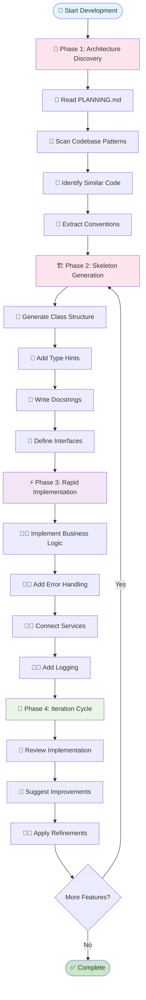
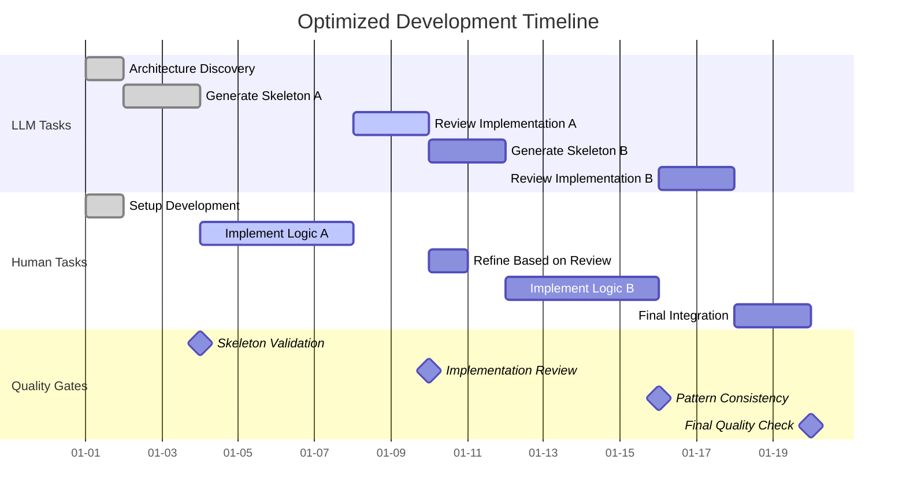
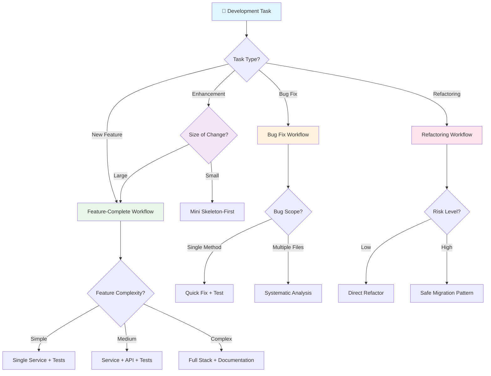

# Development Workflows

## 🏗️ Skeleton-First Development Workflow

This workflow is optimized for developers with fast typing skills who prefer LLMs to generate structural code first, then implement details manually.

### Overview

The workflow consists of 4 phases that alternate between LLM structure generation and manual implementation, maximizing both code quality and development speed.

## 📊 Main Workflow Visualization



## ⏱️ Parallel Development Timeline



## 🎯 Quality Gates Flow

```mermaid
flowchart LR
    subgraph PRE["Pre-Implementation Quality Gates"]
        QG1["Naming Conventions"] --> QG2["Architecture Patterns"]
        QG2 --> QG3["Type Hints Complete"]
        QG3 --> QG4["Docstrings Present"]
        QG4 --> QG5["Interfaces Defined"]
    end

    subgraph POST["Post-Implementation Quality Gates"]
        QG6["Error Handling"] --> QG7["Logging Patterns"]
        QG7 --> QG8["Dependency Injection"]
        QG8 --> QG9["Code Consistency"]
        QG9 --> QG10["Security Considerations"]
    end

    QG5 --> IMPLEMENT["Begin Implementation"]
    IMPLEMENT --> QG6

    style QG1 fill:#c8e6c9
    style QG2 fill:#c8e6c9
    style QG3 fill:#c8e6c9
    style QG4 fill:#c8e6c9
    style QG5 fill:#c8e6c9
    style QG6 fill:#ffecb3
    style QG7 fill:#ffecb3
    style QG8 fill:#ffecb3
    style QG9 fill:#ffecb3
    style QG10 fill:#ffecb3
    style IMPLEMENT fill:#e1f5fe
```



## Phase 1: Architecture Discovery (LLM-Led)

**Goal**: Understand existing patterns and prepare for skeleton generation

**LLM Actions:**

1. Read PLANNING.md for architecture patterns and tech stack
2. Scan existing codebase for naming conventions using `grep` and `ls`
3. Identify similar implementations in the project
4. Extract established patterns (error handling, logging, dependency injection)

**Request Pattern:**

```
"Scan the codebase and create a skeleton for [feature] following existing patterns"
```

**Expected LLM Response:**

- Reference to existing similar code patterns found
- Identification of naming conventions used
- Architecture pattern confirmation from PLANNING.md
- Ready to generate skeleton

## Phase 2: Skeleton Generation (LLM Output)

**Goal**: Generate complete structural framework with no implementation logic

**LLM Provides:**

- Complete class and method declarations
- Proper type hints for all parameters and return values
- Comprehensive docstrings (Google style)
- Interface definitions
- Exception class definitions
- Import statements following project conventions

**Skeleton Example:**

```python
class UserAuthenticationService:
    """
    Handles user authentication operations following the established auth patterns.

    This service integrates with the existing user management system and follows
    the repository pattern established in the codebase.
    """

    def __init__(self, user_repository: UserRepository, token_service: TokenService) -> None:
        """
        Initialize the authentication service with required dependencies.

        Args:
            user_repository: Repository for user data operations
            token_service: Service for JWT token operations
        """
        pass

    async def authenticate_user(self, email: str, password: str) -> AuthResult:
        """
        Authenticate user with email and password.

        Args:
            email: User's email address
            password: Plain text password

        Returns:
            AuthResult containing user data and token if successful

        Raises:
            AuthenticationError: When credentials are invalid
            ValidationError: When input format is invalid
        """
        pass

    async def refresh_token(self, refresh_token: str) -> TokenPair:
        """
        Generate new access token from refresh token.

        Args:
            refresh_token: Valid refresh token

        Returns:
            New access and refresh token pair

        Raises:
            TokenExpiredError: When refresh token is expired
            InvalidTokenError: When token format is invalid
        """
        pass
```

## Phase 3: Rapid Implementation (Human-Led)

**Goal**: Fill in method bodies with business logic using fast typing skills

**Human Focus Areas:**

- Implement business logic within method bodies
- Add error handling following established patterns
- Connect to existing services and repositories
- Implement data transformations and validations
- Add logging following project conventions

**Implementation Guidelines:**

- Keep the existing method signatures unchanged
- Follow error handling patterns found in existing code
- Use established logging and monitoring patterns
- Maintain consistency with existing service integrations

## Phase 4: Iteration Cycle (Collaborative)

**Goal**: Refine implementation and ensure pattern consistency

**Process:**

1. Human implements method bodies
2. LLM reviews against existing patterns
3. LLM suggests improvements for consistency
4. Human applies refinements
5. Repeat for additional methods or edge cases

**Review Request Pattern:**

```
"Review my implementation of [method_name] against the skeleton and existing patterns. Check for consistency and suggest optimizations."
```

## 🔄 Speed Optimization Techniques

### 1. Parallel Development

- **LLM**: Generates skeleton for Module A
- **Human**: Implements Module B (previously generated)
- **LLM**: Reviews Human's Module B implementation
- **Human**: Refines Module A skeleton and begins implementation

### 2. Template-Based Requests

```
"Using the UserService template, create skeleton for ProductService with CRUD operations"
```

### 3. Batch Skeleton Generation

```
"Generate skeletons for all services needed for [feature]:
- [Service1] for data operations
- [Service2] for business logic
- [Service3] for external integrations
Follow existing patterns, structure only."
```

## 📝 Optimized Request Patterns

### For New Features

```
"Create skeleton for [FeatureName] following existing [similar_feature] patterns. Include:
- Main service class with dependency injection
- Data models with type hints
- Exception classes
- Interface definitions
Focus on structure and naming only, no implementation."
```

### For API Endpoints

```
"Generate API controller skeleton for [endpoint_group] following existing REST patterns:
- Route definitions with proper HTTP methods
- Request/response models
- Parameter validation structure
- Error handling framework"
```

### For Data Models

```
"Create data model skeletons for [domain] following existing ORM patterns:
- Entity classes with relationships
- DTO classes for API responses
- Validation rules structure
- Database migration outline"
```

### For Test Skeletons

```
"Generate test skeleton for [ClassName] following existing test patterns:
- Test class structure
- Setup and teardown methods
- Happy path, edge case, and failure test methods
- Mock configuration structure"
```

## 🎯 Quality Gates

### Before Implementation (LLM Checklist)

- [ ] Follows existing naming conventions from codebase scan
- [ ] Matches established architectural patterns from PLANNING.md
- [ ] Includes proper type hints for all parameters and returns
- [ ] Has comprehensive Google-style docstrings
- [ ] Defines clear interfaces and exception handling
- [ ] Import statements follow project conventions

### After Implementation (LLM Review Checklist)

- [ ] Error handling matches project patterns
- [ ] Logging follows established format and levels
- [ ] Dependencies are properly injected following existing patterns
- [ ] Code consistency with existing implementations
- [ ] Security considerations addressed
- [ ] Performance implications considered

## 📋 Communication Templates

### Starting New Feature

```
"I'm implementing [feature_name]. First, scan existing [similar_area] code and generate complete skeleton following established patterns. Include all classes, methods, type hints, and docstrings but no implementation logic."
```

### Requesting Implementation Review

```
"Review my implementation of [method_name] against the skeleton and existing patterns. Check for:
- Pattern consistency
- Error handling alignment
- Performance optimizations
- Security considerations"
```

### Expanding Existing Skeletons

```
"Expand the [ClassName] skeleton to include [additional_functionality] following the same patterns used in existing methods."
```

### Requesting Test Skeletons

```
"Generate test skeleton for the implemented [ClassName] following existing test patterns. Include setup, happy path, edge cases, and failure scenarios."
```

## 🔧 IDE Integration Tips

### Skeleton Validation Process

1. LLM generates skeleton
2. Copy skeleton to IDE
3. Check syntax highlighting and type checking
4. Request adjustments if IDE shows errors
5. Begin implementation with confirmed structure

### Progressive Enhancement

1. Start with basic skeleton
2. Implement core logic (manual typing)
3. Request enhanced skeleton for edge cases
4. Implement edge cases (manual typing)
5. Request test skeletons
6. Implement tests (manual typing)

## 🚀 Advanced Workflow Patterns

```mermaid
graph TB
    subgraph FEATURE["Feature-Complete Development"]
        F1["Generate Service Skeleton"] --> F2["Implement Service Logic"]
        F2 --> F3["Generate API Controller Skeleton"]
        F3 --> F4["Implement API Endpoints"]
        F4 --> F5["Generate Test Skeletons"]
        F5 --> F6["Implement All Tests"]
        F6 --> F7["Generate Documentation Skeleton"]
        F7 --> F8["Complete Documentation"]
    end

    subgraph BUGFIX["Bug Fix Workflow"]
        B1["Analyze Code Patterns"] --> B2["Generate Fix Skeleton"]
        B2 --> B3["Implement Fix Logic"]
        B3 --> B4["Generate Test Skeleton"]
        B4 --> B5["Implement Regression Tests"]
    end

    subgraph REFACTOR["Refactoring Workflow"]
        R1["Generate New Structure"] --> R2["Implement Migration"]
        R2 --> R3["Generate Dual Tests"]
        R3 --> R4["Implement Test Coverage"]
        R4 --> R5["Execute Migration"]
    end

    style F1 fill:#fce4ec
    style F3 fill:#fce4ec
    style F5 fill:#fce4ec
    style F7 fill:#fce4ec
    style F2 fill:#f3e5f5
    style F4 fill:#f3e5f5
    style F6 fill:#f3e5f5
    style F8 fill:#f3e5f5

    style B1 fill:#fce4ec
    style B2 fill:#fce4ec
    style B4 fill:#fce4ec
    style B3 fill:#f3e5f5
    style B5 fill:#f3e5f5

    style R1 fill:#fce4ec
    style R3 fill:#fce4ec
    style R2 fill:#f3e5f5
    style R4 fill:#f3e5f5
    style R5 fill:#e0f2f1
```



### Feature-Complete Development

```
Phase 1: Generate service skeleton
Phase 2: Implement service logic
Phase 3: Generate API controller skeleton
Phase 4: Implement API endpoints
Phase 5: Generate test skeletons
Phase 6: Implement all tests
Phase 7: Generate documentation skeleton
Phase 8: Complete documentation
```

### Bug Fix Workflow

```
Phase 1: Analyze existing code patterns around bug
Phase 2: Generate fix skeleton maintaining existing structure
Phase 3: Implement fix logic
Phase 4: Generate test skeleton for regression testing
Phase 5: Implement regression tests
```

### Refactoring Workflow

```
Phase 1: Generate new structure skeleton following improved patterns
Phase 2: Implement migration logic
Phase 3: Generate tests for both old and new implementations
Phase 4: Implement comprehensive test coverage
Phase 5: Execute migration with rollback plan
```

## 📊 Workflow Decision Tree



This workflow maximizes development speed while maintaining code quality, consistency, and architectural integrity throughout the project.
