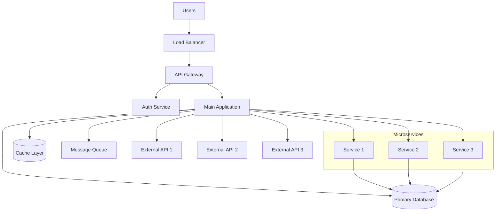
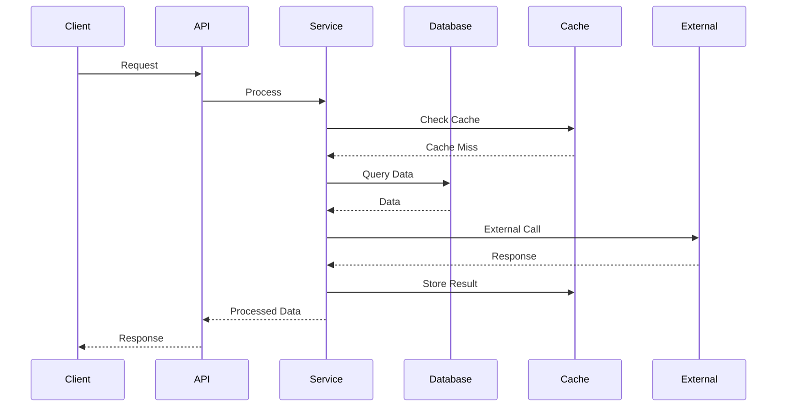

# Project Documentation Templates

This file contains all templates for the comprehensive project documentation system.

---

## Template 1: PROJECT-OVERVIEW.md

````markdown
# [PROJECT_NAME]

## Table of Contents

- [Project Overview](#project-overview)
- [Business Context](#business-context)
- [Tech Stack](#tech-stack)
- [System Architecture](#system-architecture)
- [Key Features](#key-features)
- [Integration Points](#integration-points)
- [Deployment Strategy](#deployment-strategy)
- [Architecture Diagrams](#architecture-diagrams)
- [Getting Started](#getting-started)
- [Related Documentation](#related-documentation)

## Project Overview

<!-- USER_INPUT: Project description and purpose -->

[PROJECT_DESCRIPTION]

**Purpose**: [PROJECT_PURPOSE]
**Target Users**: [TARGET_USERS]
**Main Goals**: [MAIN_GOALS]

## Business Context

<!-- USER_INPUT: Business context and domain information -->

**Domain**: [BUSINESS_DOMAIN]
**Industry**: [INDUSTRY_CONTEXT]
**Key Stakeholders**: [STAKEHOLDERS]

**Business Rules**:

- [BUSINESS_RULE_1]
- [BUSINESS_RULE_2]
- [BUSINESS_RULE_3]

**Success Metrics**:

- [METRIC_1]
- [METRIC_2]
- [METRIC_3]

## Tech Stack

<!-- DYNAMIC: Auto-detected from codebase analysis -->

### Core Technologies

- **Backend**: [BACKEND_TECH] <!-- Node.js, Python, Java, etc. -->
- **Frontend**: [FRONTEND_TECH] <!-- React, Vue, Angular, etc. -->
- **Database**: [DATABASE_TECH] <!-- PostgreSQL, MongoDB, etc. -->
- **Cache**: [CACHE_TECH] <!-- Redis, Memcached, etc. -->

### Development Tools

- **Package Manager**: [PACKAGE_MANAGER] <!-- npm, yarn, pip, etc. -->
- **Build Tool**: [BUILD_TOOL] <!-- Webpack, Vite, Maven, etc. -->
- **Testing**: [TESTING_FRAMEWORK] <!-- Jest, Pytest, JUnit, etc. -->
- **Code Quality**: [CODE_QUALITY_TOOLS] <!-- ESLint, Prettier, etc. -->

### Infrastructure

- **Containerization**: [CONTAINER_TECH] <!-- Docker, Kubernetes -->
- **Cloud Platform**: [CLOUD_PLATFORM] <!-- AWS, GCP, Azure -->
- **CI/CD**: [CICD_PLATFORM] <!-- GitHub Actions, Jenkins, etc. -->
- **Monitoring**: [MONITORING_TOOLS] <!-- Prometheus, DataDog, etc. -->

## System Architecture

<!-- DYNAMIC: Generated from project structure analysis -->

### Architectural Pattern

This project follows a **[ARCHITECTURE_PATTERN]** architecture with the following layers:

1. **[LAYER_1_NAME]** ([LAYER_1_PATH])
   - [LAYER_1_RESPONSIBILITY]
   - Key components: [LAYER_1_COMPONENTS]

2. **[LAYER_2_NAME]** ([LAYER_2_PATH])
   - [LAYER_2_RESPONSIBILITY]
   - Key components: [LAYER_2_COMPONENTS]

3. **[LAYER_3_NAME]** ([LAYER_3_PATH])
   - [LAYER_3_RESPONSIBILITY]
   - Key components: [LAYER_3_COMPONENTS]

4. **[LAYER_4_NAME]** ([LAYER_4_PATH])
   - [LAYER_4_RESPONSIBILITY]
   - Key components: [LAYER_4_COMPONENTS]

### Core Components

#### [COMPONENT_1_NAME]

**Location**: `[COMPONENT_1_PATH]`
**Purpose**: [COMPONENT_1_PURPOSE]
**Key Classes**: [COMPONENT_1_CLASSES]

#### [COMPONENT_2_NAME]

**Location**: `[COMPONENT_2_PATH]`
**Purpose**: [COMPONENT_2_PURPOSE]
**Key Classes**: [COMPONENT_2_CLASSES]

#### [COMPONENT_3_NAME]

**Location**: `[COMPONENT_3_PATH]`
**Purpose**: [COMPONENT_3_PURPOSE]
**Key Classes**: [COMPONENT_3_CLASSES]

## Key Features

<!-- USER_INPUT + DYNAMIC: From user input and code analysis -->

### [FEATURE_GROUP_1]

- **[FEATURE_1_1]**: [FEATURE_1_1_DESCRIPTION]
- **[FEATURE_1_2]**: [FEATURE_1_2_DESCRIPTION]
- **[FEATURE_1_3]**: [FEATURE_1_3_DESCRIPTION]

### [FEATURE_GROUP_2]

- **[FEATURE_2_1]**: [FEATURE_2_1_DESCRIPTION]
- **[FEATURE_2_2]**: [FEATURE_2_2_DESCRIPTION]
- **[FEATURE_2_3]**: [FEATURE_2_3_DESCRIPTION]

### [FEATURE_GROUP_3]

- **[FEATURE_3_1]**: [FEATURE_3_1_DESCRIPTION]
- **[FEATURE_3_2]**: [FEATURE_3_2_DESCRIPTION]
- **[FEATURE_3_3]**: [FEATURE_3_3_DESCRIPTION]

## Integration Points

<!-- DYNAMIC: Detected from code analysis -->

### External APIs

- **[API_1_NAME]**: [API_1_PURPOSE] ([API_1_ENDPOINT])
- **[API_2_NAME]**: [API_2_PURPOSE] ([API_2_ENDPOINT])
- **[API_3_NAME]**: [API_3_PURPOSE] ([API_3_ENDPOINT])

### Third-Party Services

- **[SERVICE_1_NAME]**: [SERVICE_1_PURPOSE]
- **[SERVICE_2_NAME]**: [SERVICE_2_PURPOSE]
- **[SERVICE_3_NAME]**: [SERVICE_3_PURPOSE]

### Database Connections

- **Primary DB**: [PRIMARY_DB_TYPE] ([PRIMARY_DB_NAME])
- **Cache Layer**: [CACHE_TYPE] ([CACHE_NAME])
- **Analytics DB**: [ANALYTICS_DB_TYPE] ([ANALYTICS_DB_NAME])

## Deployment Strategy

<!-- DYNAMIC: Detected from deployment files -->

### Environments

- **Development**: [DEV_ENVIRONMENT_INFO]
- **Staging**: [STAGING_ENVIRONMENT_INFO]
- **Production**: [PROD_ENVIRONMENT_INFO]

### Deployment Process

1. **Build Process**: [BUILD_PROCESS]
2. **Testing Pipeline**: [TESTING_PIPELINE]
3. **Deployment Method**: [DEPLOYMENT_METHOD]
4. **Monitoring**: [MONITORING_SETUP]

### Infrastructure

- **Hosting**: [HOSTING_PLATFORM]
- **Load Balancing**: [LOAD_BALANCER_CONFIG]
- **SSL/Security**: [SECURITY_CONFIG]
- **Backup Strategy**: [BACKUP_STRATEGY]

## Architecture Diagrams

### System Overview


````

### Component Architecture

```mermaid
classDiagram
    class [MAIN_CLASS] {
        +[PROPERTY_1]: [TYPE_1]
        +[PROPERTY_2]: [TYPE_2]
        +[METHOD_1]()
        +[METHOD_2]()
    }

    class [SERVICE_CLASS] {
        +[SERVICE_METHOD_1]()
        +[SERVICE_METHOD_2]()
    }

    class [REPOSITORY_CLASS] {
        +[REPO_METHOD_1]()
        +[REPO_METHOD_2]()
    }

    [MAIN_CLASS] --> [SERVICE_CLASS]
    [SERVICE_CLASS] --> [REPOSITORY_CLASS]
    [REPOSITORY_CLASS] --> [DATABASE]
```

### Data Flow



## Getting Started

For detailed setup instructions, see: [DEVELOPER-GUIDE.md](./DEVELOPER-GUIDE.md)

**Quick Start:**

```bash
# Clone repository
git clone [REPOSITORY_URL]

# Install dependencies
[INSTALL_COMMAND]

# Start development server
[START_COMMAND]
```

## Related Documentation

- **[DEVELOPER-GUIDE.md](./DEVELOPER-GUIDE.md)** - Setup, installation, and development workflow
- **[CODING-STANDARDS.md](./CODING-STANDARDS.md)** - Code conventions and patterns
- **[CODEBASE-REFERENCE.md](./CODEBASE-REFERENCE.md)** - Complete code reference and API documentation
- **[DEPENDENCIES-GUIDE.md](./DEPENDENCIES-GUIDE.md)** - External libraries and services
- **[LLM-CONTEXT.md](./LLM-CONTEXT.md)** - AI development context and patterns

---

**Last Updated**: [TIMESTAMP]
**Version**: [VERSION]
**Generated by**: Claude Code Assistant

````

---

## Template 2: DEVELOPER-GUIDE.md

```markdown
# Developer Guide

## Table of Contents

- [Quick Start](#quick-start)
- [Prerequisites](#prerequisites)
- [Installation](#installation)
- [Development Workflow](#development-workflow)
- [Testing](#testing)
- [Build Process](#build-process)
- [Common Tasks](#common-tasks)
- [Troubleshooting](#troubleshooting)
- [Contributing](#contributing)

## Quick Start

<!-- DYNAMIC: Generated from package.json scripts and setup -->

```bash
# Clone the repository
git clone [REPOSITORY_URL]
cd [PROJECT_NAME]

# Install dependencies
[INSTALL_COMMAND]

# Set up environment
[ENV_SETUP_COMMAND]

# Start development server
[DEV_START_COMMAND]
````

**Access the application:**

- **Frontend**: [FRONTEND_URL]
- **Backend API**: [BACKEND_URL]
- **Documentation**: [DOCS_URL]

## Prerequisites

<!-- DYNAMIC: Extracted from package.json engines and dependencies -->

### System Requirements

- **[RUNTIME_1]**: [VERSION_REQUIREMENT_1]
- **[RUNTIME_2]**: [VERSION_REQUIREMENT_2]
- **[DATABASE]**: [DATABASE_VERSION]
- **[ADDITIONAL_TOOL]**: [TOOL_VERSION]

### Development Tools

- **[TOOL_1]**: [TOOL_1_PURPOSE]
- **[TOOL_2]**: [TOOL_2_PURPOSE]
- **[TOOL_3]**: [TOOL_3_PURPOSE]

### Optional Tools

- **[OPTIONAL_TOOL_1]**: [OPTIONAL_TOOL_1_PURPOSE]
- **[OPTIONAL_TOOL_2]**: [OPTIONAL_TOOL_2_PURPOSE]

## Installation

<!-- DYNAMIC: Generated from package manager and setup scripts -->

### 1. Environment Setup

```bash
# [ENVIRONMENT_SETUP_DESCRIPTION]
[ENV_SETUP_COMMANDS]
```

### 2. Dependencies Installation

```bash
# [DEPENDENCY_INSTALLATION_DESCRIPTION]
[DEPENDENCY_COMMANDS]
```

### 3. Database Setup

```bash
# [DATABASE_SETUP_DESCRIPTION]
[DATABASE_COMMANDS]
```

### 4. Configuration

```bash
# [CONFIGURATION_DESCRIPTION]
[CONFIG_COMMANDS]
```

## Development Workflow

<!-- DYNAMIC: Generated from npm scripts and git workflows -->

### Daily Development

```bash
# Start development environment
[DEV_START_COMMAND]

# Run tests in watch mode
[TEST_WATCH_COMMAND]

# Code formatting
[FORMAT_COMMAND]

# Code linting
[LINT_COMMAND]
```

### Feature Development

1. **Create feature branch**: `[BRANCH_COMMAND]`
2. **Develop feature**: Follow coding standards
3. **Run tests**: `[TEST_COMMAND]`
4. **Create pull request**: Follow PR template
5. **Code review**: Address feedback
6. **Merge to main**: After approval

### Database Changes

```bash
# Create migration
[MIGRATION_CREATE_COMMAND]

# Run migrations
[MIGRATION_RUN_COMMAND]

# Rollback migration
[MIGRATION_ROLLBACK_COMMAND]
```

## Testing

<!-- DYNAMIC: Generated from test framework detection -->

### Test Types

- **Unit Tests**: [UNIT_TEST_DESCRIPTION]
- **Integration Tests**: [INTEGRATION_TEST_DESCRIPTION]
- **End-to-End Tests**: [E2E_TEST_DESCRIPTION]

### Running Tests

```bash
# Run all tests
[TEST_ALL_COMMAND]

# Run specific test suite
[TEST_SPECIFIC_COMMAND]

# Run tests with coverage
[TEST_COVERAGE_COMMAND]

# Run tests in watch mode
[TEST_WATCH_COMMAND]
```

### Test Coverage

- **Minimum Coverage**: [COVERAGE_THRESHOLD]%
- **Coverage Reports**: [COVERAGE_REPORT_LOCATION]

## Build Process

<!-- DYNAMIC: Generated from build tools detection -->

### Development Build

```bash
# Build for development
[DEV_BUILD_COMMAND]
```

### Production Build

```bash
# Build for production
[PROD_BUILD_COMMAND]
```

### Build Optimization

- **[OPTIMIZATION_1]**: [OPTIMIZATION_1_DESCRIPTION]
- **[OPTIMIZATION_2]**: [OPTIMIZATION_2_DESCRIPTION]

## Common Tasks

<!-- DYNAMIC: Generated from npm scripts and common operations -->

### Code Quality

```bash
# Format code
[FORMAT_COMMAND]

# Lint code
[LINT_COMMAND]

# Fix lint issues
[LINT_FIX_COMMAND]

# Type checking
[TYPE_CHECK_COMMAND]
```

### Database Operations

```bash
# Reset database
[DB_RESET_COMMAND]

# Seed database
[DB_SEED_COMMAND]

# Backup database
[DB_BACKUP_COMMAND]
```

### Debugging

```bash
# Start with debugger
[DEBUG_COMMAND]

# View logs
[LOGS_COMMAND]

# Performance profiling
[PROFILE_COMMAND]
```

## Troubleshooting

### Common Issues

1. **[ISSUE_1]**: [ISSUE_1_SOLUTION]
2. **[ISSUE_2]**: [ISSUE_2_SOLUTION]
3. **[ISSUE_3]**: [ISSUE_3_SOLUTION]

### Debug Commands

```bash
# Check system info
[SYSTEM_INFO_COMMAND]

# Clear cache
[CACHE_CLEAR_COMMAND]

# Reinstall dependencies
[REINSTALL_COMMAND]
```

## Contributing

### Code Standards

- Follow [CODING-STANDARDS.md](./CODING-STANDARDS.md)
- Use [LLM-CONTEXT.md](./LLM-CONTEXT.md) for AI development

### Pull Request Process

1. **Fork the repository**
2. **Create feature branch**
3. **Write tests**
4. **Follow commit conventions**
5. **Submit pull request**
6. **Address review feedback**

### Commit Convention

```
[TYPE]([SCOPE]): [DESCRIPTION]

[BODY]

[FOOTER]
```

---

**Last Updated**: [TIMESTAMP]
**Version**: [VERSION]
**Generated by**: Claude Code Assistant

````

---

## Template 3: CODING-STANDARDS.md

```markdown
# Coding Standards

## Table of Contents

- [Naming Conventions](#naming-conventions)
- [File Organization](#file-organization)
- [Code Structure](#code-structure)
- [Error Handling](#error-handling)
- [Logging Standards](#logging-standards)
- [Security Practices](#security-practices)
- [Performance Guidelines](#performance-guidelines)
- [Testing Standards](#testing-standards)
- [Documentation Requirements](#documentation-requirements)
- [Code Review Guidelines](#code-review-guidelines)

## Naming Conventions

<!-- DYNAMIC: Analyzed from actual codebase patterns -->

### Variables and Functions
- **Pattern**: [VARIABLE_NAMING_PATTERN] <!-- camelCase, snake_case, etc. -->
- **Examples**:
  - ✅ `[GOOD_VARIABLE_EXAMPLE]`
  - ❌ `[BAD_VARIABLE_EXAMPLE]`

### Classes and Interfaces
- **Pattern**: [CLASS_NAMING_PATTERN] <!-- PascalCase, etc. -->
- **Examples**:
  - ✅ `[GOOD_CLASS_EXAMPLE]`
  - ❌ `[BAD_CLASS_EXAMPLE]`

### Files and Directories
- **Pattern**: [FILE_NAMING_PATTERN] <!-- kebab-case, camelCase, etc. -->
- **Examples**:
  - ✅ `[GOOD_FILE_EXAMPLE]`
  - ❌ `[BAD_FILE_EXAMPLE]`

### Constants and Enums
- **Pattern**: [CONSTANT_NAMING_PATTERN] <!-- UPPER_SNAKE_CASE, etc. -->
- **Examples**:
  - ✅ `[GOOD_CONSTANT_EXAMPLE]`
  - ❌ `[BAD_CONSTANT_EXAMPLE]`

### Database and API Naming
- **Tables**: [TABLE_NAMING_PATTERN] <!-- snake_case, etc. -->
- **Columns**: [COLUMN_NAMING_PATTERN] <!-- snake_case, etc. -->
- **Endpoints**: [ENDPOINT_NAMING_PATTERN] <!-- kebab-case, etc. -->

## File Organization

<!-- DYNAMIC: Generated from project structure analysis -->

### Project Structure
````

[PROJECT_ROOT]/
├── [SOURCE_FOLDER]/ # [SOURCE_FOLDER_PURPOSE]
│ ├── [COMPONENT_FOLDER_1]/ # [COMPONENT_1_PURPOSE]
│ │ ├── [COMPONENT_1_FILE_1]
│ │ ├── [COMPONENT_1_FILE_2]
│ │ └── index.[EXT]
│ ├── [COMPONENT_FOLDER_2]/ # [COMPONENT_2_PURPOSE]
│ │ ├── [COMPONENT_2_FILE_1]
│ │ ├── [COMPONENT_2_FILE_2]
│ │ └── index.[EXT]
│ └── [SHARED_FOLDER]/ # [SHARED_FOLDER_PURPOSE]
│ ├── [SHARED_FILE_1]
│ └── [SHARED_FILE_2]
├── [TEST_FOLDER]/ # [TEST_FOLDER_PURPOSE]
├── [CONFIG_FOLDER]/ # [CONFIG_FOLDER_PURPOSE]
└── [DOCS_FOLDER]/ # [DOCS_FOLDER_PURPOSE]

````

### File Organization Rules
1. **[ORGANIZATION_RULE_1]**: [RULE_1_DESCRIPTION]
2. **[ORGANIZATION_RULE_2]**: [RULE_2_DESCRIPTION]
3. **[ORGANIZATION_RULE_3]**: [RULE_3_DESCRIPTION]

### Import Organization
```[LANGUAGE]
// [COMMENT_STYLE] 1. Standard library imports
[STANDARD_IMPORT_EXAMPLE]

// [COMMENT_STYLE] 2. Third-party library imports
[THIRD_PARTY_IMPORT_EXAMPLE]

// [COMMENT_STYLE] 3. Internal imports (absolute)
[INTERNAL_ABSOLUTE_IMPORT_EXAMPLE]

// [COMMENT_STYLE] 4. Relative imports
[RELATIVE_IMPORT_EXAMPLE]
````

## Code Structure

<!-- DYNAMIC: Patterns detected from codebase analysis -->

### Function Structure

```[LANGUAGE]
/**
 * [FUNCTION_DESCRIPTION]
 * @param {[PARAM_TYPE]} [PARAM_NAME] - [PARAM_DESCRIPTION]
 * @returns {[RETURN_TYPE]} [RETURN_DESCRIPTION]
 */
[FUNCTION_SIGNATURE] {
    // [VALIDATION_PATTERN]
    [VALIDATION_EXAMPLE]

    // [MAIN_LOGIC_PATTERN]
    [MAIN_LOGIC_EXAMPLE]

    // [RETURN_PATTERN]
    [RETURN_EXAMPLE]
}
```

### Class Structure

```[LANGUAGE]
/**
 * [CLASS_DESCRIPTION]
 */
class [CLASS_NAME] {
    // [PROPERTY_PATTERN]
    [PROPERTY_EXAMPLE]

    /**
     * [CONSTRUCTOR_DESCRIPTION]
     */
    constructor([CONSTRUCTOR_PARAMS]) {
        [CONSTRUCTOR_BODY]
    }

    // [PUBLIC_METHOD_PATTERN]
    [PUBLIC_METHOD_EXAMPLE]

    // [PRIVATE_METHOD_PATTERN]
    [PRIVATE_METHOD_EXAMPLE]
}
```

### Module Structure

```[LANGUAGE]
[MODULE_HEADER_COMMENT]

[IMPORTS_SECTION]

[CONSTANTS_SECTION]

[TYPES_SECTION]

[MAIN_IMPLEMENTATION]

[EXPORTS_SECTION]
```

## Error Handling

<!-- DYNAMIC: Patterns detected from existing error handling -->

### Error Types

- **[ERROR_TYPE_1]**: [ERROR_TYPE_1_USAGE]
- **[ERROR_TYPE_2]**: [ERROR_TYPE_2_USAGE]
- **[ERROR_TYPE_3]**: [ERROR_TYPE_3_USAGE]

### Error Handling Pattern

```[LANGUAGE]
try {
    [OPERATION_EXAMPLE]
} catch ([ERROR_VARIABLE]) {
    [ERROR_HANDLING_PATTERN]
    [LOGGING_PATTERN]
    [ERROR_RESPONSE_PATTERN]
}
```

### Custom Error Classes

```[LANGUAGE]
class [CUSTOM_ERROR_CLASS] extends [BASE_ERROR_CLASS] {
    constructor([ERROR_PARAMS]) {
        super([SUPER_PARAMS]);
        [CUSTOM_ERROR_PROPERTIES]
    }
}
```

### Error Response Format

```[LANGUAGE]
{
    "error": {
        "code": "[ERROR_CODE]",
        "message": "[ERROR_MESSAGE]",
        "details": [ERROR_DETAILS],
        "timestamp": "[TIMESTAMP]"
    }
}
```

## Logging Standards

<!-- DYNAMIC: Logging patterns detected from codebase -->

### Log Levels

- **[LOG_LEVEL_1]**: [LOG_LEVEL_1_USAGE]
- **[LOG_LEVEL_2]**: [LOG_LEVEL_2_USAGE]
- **[LOG_LEVEL_3]**: [LOG_LEVEL_3_USAGE]
- **[LOG_LEVEL_4]**: [LOG_LEVEL_4_USAGE]

### Logging Pattern

```[LANGUAGE]
[LOGGER_IMPORT]

// [LOGGING_EXAMPLE_1]
[LOGGING_STATEMENT_1]

// [LOGGING_EXAMPLE_2]
[LOGGING_STATEMENT_2]

// [LOGGING_EXAMPLE_3]
[LOGGING_STATEMENT_3]
```

### Log Format

```
[TIMESTAMP] [LOG_LEVEL] [COMPONENT] - [MESSAGE] [CONTEXT]
```

### What to Log

- **✅ Do Log**: [DO_LOG_EXAMPLES]
- **❌ Don't Log**: [DONT_LOG_EXAMPLES]

## Security Practices

<!-- DYNAMIC: Security patterns detected from codebase -->

### Input Validation

```[LANGUAGE]
[VALIDATION_LIBRARY_IMPORT]

[VALIDATION_SCHEMA_EXAMPLE]

[VALIDATION_USAGE_EXAMPLE]
```

### Authentication Pattern

```[LANGUAGE]
[AUTH_MIDDLEWARE_EXAMPLE]

[AUTH_VERIFICATION_EXAMPLE]
```

### Authorization Pattern

```[LANGUAGE]
[AUTHORIZATION_MIDDLEWARE_EXAMPLE]

[PERMISSION_CHECK_EXAMPLE]
```

### Data Sanitization

```[LANGUAGE]
[SANITIZATION_EXAMPLE]
```

### Environment Variables

```[LANGUAGE]
// ✅ Secure environment variable usage
[SECURE_ENV_USAGE]

// ❌ Never hardcode secrets
[HARDCODED_SECRET_EXAMPLE]
```

## Performance Guidelines

<!-- DYNAMIC: Performance patterns detected from codebase -->

### Database Queries

```[LANGUAGE]
// ✅ Efficient query
[EFFICIENT_QUERY_EXAMPLE]

// ❌ Inefficient query
[INEFFICIENT_QUERY_EXAMPLE]
```

### Caching Strategy

```[LANGUAGE]
[CACHING_IMPLEMENTATION_EXAMPLE]
```

### Async/Await Patterns

```[LANGUAGE]
// ✅ Proper async handling
[GOOD_ASYNC_EXAMPLE]

// ❌ Blocking operations
[BAD_ASYNC_EXAMPLE]
```

### Resource Management

```[LANGUAGE]
[RESOURCE_MANAGEMENT_EXAMPLE]
```

## Testing Standards

<!-- DYNAMIC: Testing patterns detected from test files -->

### Test File Organization

```
[TEST_FOLDER]/
├── [UNIT_TEST_FOLDER]/
│   ├── [UNIT_TEST_FILE_1]
│   └── [UNIT_TEST_FILE_2]
├── [INTEGRATION_TEST_FOLDER]/
│   ├── [INTEGRATION_TEST_FILE_1]
│   └── [INTEGRATION_TEST_FILE_2]
└── [E2E_TEST_FOLDER]/
    ├── [E2E_TEST_FILE_1]
    └── [E2E_TEST_FILE_2]
```

### Test Structure

```[LANGUAGE]
[TEST_IMPORT_EXAMPLE]

describe('[TEST_SUITE_NAME]', () => {
    [TEST_SETUP_EXAMPLE]

    [TEST_TEARDOWN_EXAMPLE]

    test('[TEST_CASE_NAME]', () => {
        // Arrange
        [ARRANGE_EXAMPLE]

        // Act
        [ACT_EXAMPLE]

        // Assert
        [ASSERT_EXAMPLE]
    });
});
```

### Test Coverage Requirements

- **Minimum Coverage**: [COVERAGE_THRESHOLD]%
- **Critical Components**: [CRITICAL_COVERAGE_THRESHOLD]%
- **Test Types Required**: [REQUIRED_TEST_TYPES]

## Documentation Requirements

### Code Comments

```[LANGUAGE]
/**
 * [FUNCTION_DESCRIPTION]
 *
 * [DETAILED_DESCRIPTION]
 *
 * @param {[PARAM_TYPE]} [PARAM_NAME] - [PARAM_DESCRIPTION]
 * @returns {[RETURN_TYPE]} [RETURN_DESCRIPTION]
 * @throws {[ERROR_TYPE]} [ERROR_DESCRIPTION]
 *
 * @example
 * [USAGE_EXAMPLE]
 */
```

### README Requirements

- **Installation instructions**
- **Usage examples**
- **API documentation**
- **Contributing guidelines**

### API Documentation

```[LANGUAGE]
/**
 * @swagger
 * [SWAGGER_DEFINITION]
 */
```

## Code Review Guidelines

### Pre-Review Checklist

- [ ] Code follows naming conventions
- [ ] Proper error handling implemented
- [ ] Security best practices followed
- [ ] Tests written and passing
- [ ] Documentation updated
- [ ] Performance considerations addressed

### Review Focus Areas

1. **Logic & Correctness**: [LOGIC_REVIEW_GUIDELINES]
2. **Code Quality**: [QUALITY_REVIEW_GUIDELINES]
3. **Security**: [SECURITY_REVIEW_GUIDELINES]
4. **Performance**: [PERFORMANCE_REVIEW_GUIDELINES]
5. **Maintainability**: [MAINTAINABILITY_REVIEW_GUIDELINES]

### Approval Criteria

- **Code Quality**: [QUALITY_CRITERIA]
- **Test Coverage**: [COVERAGE_CRITERIA]
- **Documentation**: [DOCUMENTATION_CRITERIA]
- **Security**: [SECURITY_CRITERIA]

---

**Last Updated**: [TIMESTAMP]
**Version**: [VERSION]
**Generated by**: Claude Code Assistant

````

---

## Template 4: CODEBASE-REFERENCE.md

```markdown
# Codebase Reference

## Table of Contents

- [Overview](#overview)
- [Class Inventory](#class-inventory)
- [Function Catalog](#function-catalog)
- [Service Registry](#service-registry)
- [API Endpoints](#api-endpoints)
- [Database Schema](#database-schema)
- [Constants & Configuration](#constants--configuration)
- [Utility Functions](#utility-functions)
- [Integration Points](#integration-points)

## Overview

This document provides a comprehensive reference to all classes, functions, and components in the codebase. It is automatically generated and updated to reflect the current state of the code.

## Class Inventory

<!-- DYNAMIC: Auto-generated from AST parsing -->

### [CATEGORY_1_NAME]

#### [CLASS_1_NAME]
**Location**: `[CLASS_1_PATH]`
**Purpose**: [CLASS_1_PURPOSE]

**Properties**:
- `[PROPERTY_1_NAME]`: [PROPERTY_1_TYPE] - [PROPERTY_1_DESCRIPTION]
- `[PROPERTY_2_NAME]`: [PROPERTY_2_TYPE] - [PROPERTY_2_DESCRIPTION]

**Methods**:
- `[METHOD_1_NAME]([PARAMS])`: [METHOD_1_RETURN_TYPE] - [METHOD_1_DESCRIPTION]
- `[METHOD_2_NAME]([PARAMS])`: [METHOD_2_RETURN_TYPE] - [METHOD_2_DESCRIPTION]

**Usage Example**:
```[LANGUAGE]
[USAGE_EXAMPLE]
````

#### [CLASS_2_NAME]

**Location**: `[CLASS_2_PATH]`
**Purpose**: [CLASS_2_PURPOSE]

**Properties**:

- `[PROPERTY_1_NAME]`: [PROPERTY_1_TYPE] - [PROPERTY_1_DESCRIPTION]
- `[PROPERTY_2_NAME]`: [PROPERTY_2_TYPE] - [PROPERTY_2_DESCRIPTION]

**Methods**:

- `[METHOD_1_NAME]([PARAMS])`: [METHOD_1_RETURN_TYPE] - [METHOD_1_DESCRIPTION]
- `[METHOD_2_NAME]([PARAMS])`: [METHOD_2_RETURN_TYPE] - [METHOD_2_DESCRIPTION]

**Usage Example**:

```[LANGUAGE]
[USAGE_EXAMPLE]
```

### [CATEGORY_2_NAME]

#### [CLASS_3_NAME]

**Location**: `[CLASS_3_PATH]`
**Purpose**: [CLASS_3_PURPOSE]

**Properties**:

- `[PROPERTY_1_NAME]`: [PROPERTY_1_TYPE] - [PROPERTY_1_DESCRIPTION]
- `[PROPERTY_2_NAME]`: [PROPERTY_2_TYPE] - [PROPERTY_2_DESCRIPTION]

**Methods**:

- `[METHOD_1_NAME]([PARAMS])`: [METHOD_1_RETURN_TYPE] - [METHOD_1_DESCRIPTION]
- `[METHOD_2_NAME]([PARAMS])`: [METHOD_2_RETURN_TYPE] - [METHOD_2_DESCRIPTION]

**Usage Example**:

```[LANGUAGE]
[USAGE_EXAMPLE]
```

## Function Catalog

<!-- DYNAMIC: Auto-generated from function analysis -->

### [FUNCTION_CATEGORY_1]

#### [FUNCTION_1_NAME]

**Location**: `[FUNCTION_1_PATH]`
**Purpose**: [FUNCTION_1_PURPOSE]
**Signature**: `[FUNCTION_1_SIGNATURE]`
**Returns**: [FUNCTION_1_RETURN_TYPE] - [FUNCTION_1_RETURN_DESCRIPTION]

**Parameters**:

- `[PARAM_1_NAME]`: [PARAM_1_TYPE] - [PARAM_1_DESCRIPTION]
- `[PARAM_2_NAME]`: [PARAM_2_TYPE] - [PARAM_2_DESCRIPTION]

**Usage Example**:

```[LANGUAGE]
[FUNCTION_1_USAGE_EXAMPLE]
```

#### [FUNCTION_2_NAME]

**Location**: `[FUNCTION_2_PATH]`
**Purpose**: [FUNCTION_2_PURPOSE]
**Signature**: `[FUNCTION_2_SIGNATURE]`
**Returns**: [FUNCTION_2_RETURN_TYPE] - [FUNCTION_2_RETURN_DESCRIPTION]

**Parameters**:

- `[PARAM_1_NAME]`: [PARAM_1_TYPE] - [PARAM_1_DESCRIPTION]
- `[PARAM_2_NAME]`: [PARAM_2_TYPE] - [PARAM_2_DESCRIPTION]

**Usage Example**:

```[LANGUAGE]
[FUNCTION_2_USAGE_EXAMPLE]
```

### [FUNCTION_CATEGORY_2]

#### [FUNCTION_3_NAME]

**Location**: `[FUNCTION_3_PATH]`
**Purpose**: [FUNCTION_3_PURPOSE]
**Signature**: `[FUNCTION_3_SIGNATURE]`
**Returns**: [FUNCTION_3_RETURN_TYPE] - [FUNCTION_3_RETURN_DESCRIPTION]

**Parameters**:

- `[PARAM_1_NAME]`: [PARAM_1_TYPE] - [PARAM_1_DESCRIPTION]
- `[PARAM_2_NAME]`: [PARAM_2_TYPE] - [PARAM_2_DESCRIPTION]

**Usage Example**:

```[LANGUAGE]
[FUNCTION_3_USAGE_EXAMPLE]
```

## Service Registry

<!-- DYNAMIC: Auto-generated from service analysis -->

### [SERVICE_CATEGORY_1]

#### [SERVICE_1_NAME]

**Location**: `[SERVICE_1_PATH]`
**Purpose**: [SERVICE_1_PURPOSE]
**Dependencies**: [SERVICE_1_DEPENDENCIES]

**Public Methods**:

- `[SERVICE_1_METHOD_1]([PARAMS])`: [RETURN_TYPE] - [METHOD_DESCRIPTION]
- `[SERVICE_1_METHOD_2]([PARAMS])`: [RETURN_TYPE] - [METHOD_DESCRIPTION]

**Configuration**:

```[LANGUAGE]
[SERVICE_1_CONFIG_EXAMPLE]
```

**Usage Example**:

```[LANGUAGE]
[SERVICE_1_USAGE_EXAMPLE]
```

#### [SERVICE_2_NAME]

**Location**: `[SERVICE_2_PATH]`
**Purpose**: [SERVICE_2_PURPOSE]
**Dependencies**: [SERVICE_2_DEPENDENCIES]

**Public Methods**:

- `[SERVICE_2_METHOD_1]([PARAMS])`: [RETURN_TYPE] - [METHOD_DESCRIPTION]
- `[SERVICE_2_METHOD_2]([PARAMS])`: [RETURN_TYPE] - [METHOD_DESCRIPTION]

**Configuration**:

```[LANGUAGE]
[SERVICE_2_CONFIG_EXAMPLE]
```

**Usage Example**:

```[LANGUAGE]
[SERVICE_2_USAGE_EXAMPLE]
```

## API Endpoints

<!-- DYNAMIC: Auto-generated from route analysis -->

### [API_GROUP_1]

#### [ENDPOINT_1_METHOD] [ENDPOINT_1_PATH]

**Purpose**: [ENDPOINT_1_PURPOSE]
**Authentication**: [ENDPOINT_1_AUTH_REQUIRED]
**Rate Limit**: [ENDPOINT_1_RATE_LIMIT]

**Parameters**:

- `[PARAM_1_NAME]`: [PARAM_1_TYPE] - [PARAM_1_DESCRIPTION] ([PARAM_1_REQUIRED])
- `[PARAM_2_NAME]`: [PARAM_2_TYPE] - [PARAM_2_DESCRIPTION] ([PARAM_2_REQUIRED])

**Request Example**:

```[LANGUAGE]
[ENDPOINT_1_REQUEST_EXAMPLE]
```

**Response Example**:

```[LANGUAGE]
[ENDPOINT_1_RESPONSE_EXAMPLE]
```

**Error Responses**:

- `[ERROR_CODE_1]`: [ERROR_1_DESCRIPTION]
- `[ERROR_CODE_2]`: [ERROR_2_DESCRIPTION]

#### [ENDPOINT_2_METHOD] [ENDPOINT_2_PATH]

**Purpose**: [ENDPOINT_2_PURPOSE]
**Authentication**: [ENDPOINT_2_AUTH_REQUIRED]
**Rate Limit**: [ENDPOINT_2_RATE_LIMIT]

**Parameters**:

- `[PARAM_1_NAME]`: [PARAM_1_TYPE] - [PARAM_1_DESCRIPTION] ([PARAM_1_REQUIRED])
- `[PARAM_2_NAME]`: [PARAM_2_TYPE] - [PARAM_2_DESCRIPTION] ([PARAM_2_REQUIRED])

**Request Example**:

```[LANGUAGE]
[ENDPOINT_2_REQUEST_EXAMPLE]
```

**Response Example**:

```[LANGUAGE]
[ENDPOINT_2_RESPONSE_EXAMPLE]
```

**Error Responses**:

- `[ERROR_CODE_1]`: [ERROR_1_DESCRIPTION]
- `[ERROR_CODE_2]`: [ERROR_2_DESCRIPTION]

## Database Schema

<!-- DYNAMIC: Auto-generated from database analysis -->

### Tables

#### [TABLE_1_NAME]

**Purpose**: [TABLE_1_PURPOSE]

**Columns**:

- `[COLUMN_1_NAME]`: [COLUMN_1_TYPE] - [COLUMN_1_DESCRIPTION] ([COLUMN_1_CONSTRAINTS])
- `[COLUMN_2_NAME]`: [COLUMN_2_TYPE] - [COLUMN_2_DESCRIPTION] ([COLUMN_2_CONSTRAINTS])

**Indexes**:

- `[INDEX_1_NAME]`: [INDEX_1_COLUMNS] - [INDEX_1_PURPOSE]

**Relationships**:

- `[RELATIONSHIP_1]`: [RELATIONSHIP_1_DESCRIPTION]

#### [TABLE_2_NAME]

**Purpose**: [TABLE_2_PURPOSE]

**Columns**:

- `[COLUMN_1_NAME]`: [COLUMN_1_TYPE] - [COLUMN_1_DESCRIPTION] ([COLUMN_1_CONSTRAINTS])
- `[COLUMN_2_NAME]`: [COLUMN_2_TYPE] - [COLUMN_2_DESCRIPTION] ([COLUMN_2_CONSTRAINTS])

**Indexes**:

- `[INDEX_1_NAME]`: [INDEX_1_COLUMNS] - [INDEX_1_PURPOSE]

**Relationships**:

- `[RELATIONSHIP_1]`: [RELATIONSHIP_1_DESCRIPTION]

## Constants & Configuration

<!-- DYNAMIC: Auto-generated from constants analysis -->

### Application Constants

```[LANGUAGE]
// [CONSTANT_CATEGORY_1]
[CONSTANT_1_NAME] = [CONSTANT_1_VALUE]; // [CONSTANT_1_DESCRIPTION]
[CONSTANT_2_NAME] = [CONSTANT_2_VALUE]; // [CONSTANT_2_DESCRIPTION]

// [CONSTANT_CATEGORY_2]
[CONSTANT_3_NAME] = [CONSTANT_3_VALUE]; // [CONSTANT_3_DESCRIPTION]
[CONSTANT_4_NAME] = [CONSTANT_4_VALUE]; // [CONSTANT_4_DESCRIPTION]
```

### Environment Variables

```bash
# [ENV_CATEGORY_1]
[ENV_VAR_1]=[DEFAULT_VALUE_1]  # [ENV_VAR_1_DESCRIPTION]
[ENV_VAR_2]=[DEFAULT_VALUE_2]  # [ENV_VAR_2_DESCRIPTION]

# [ENV_CATEGORY_2]
[ENV_VAR_3]=[DEFAULT_VALUE_3]  # [ENV_VAR_3_DESCRIPTION]
[ENV_VAR_4]=[DEFAULT_VALUE_4]  # [ENV_VAR_4_DESCRIPTION]
```

### Configuration Files

- **[CONFIG_FILE_1]**: [CONFIG_FILE_1_PURPOSE]
- **[CONFIG_FILE_2]**: [CONFIG_FILE_2_PURPOSE]
- **[CONFIG_FILE_3]**: [CONFIG_FILE_3_PURPOSE]

## Utility Functions

<!-- DYNAMIC: Auto-generated from utility analysis -->

### [UTILITY_CATEGORY_1]

#### [UTILITY_1_NAME]

**Location**: `[UTILITY_1_PATH]`
**Purpose**: [UTILITY_1_PURPOSE]
**Usage**: `[UTILITY_1_USAGE]`

```[LANGUAGE]
[UTILITY_1_EXAMPLE]
```

#### [UTILITY_2_NAME]

**Location**: `[UTILITY_2_PATH]`
**Purpose**: [UTILITY_2_PURPOSE]
**Usage**: `[UTILITY_2_USAGE]`

```[LANGUAGE]
[UTILITY_2_EXAMPLE]
```

### [UTILITY_CATEGORY_2]

#### [UTILITY_3_NAME]

**Location**: `[UTILITY_3_PATH]`
**Purpose**: [UTILITY_3_PURPOSE]
**Usage**: `[UTILITY_3_USAGE]`

```[LANGUAGE]
[UTILITY_3_EXAMPLE]
```

## Integration Points

<!-- DYNAMIC: Auto-generated from integration analysis -->

### External APIs

- **[EXTERNAL_API_1]**: [API_1_DESCRIPTION]
  - **Base URL**: [API_1_BASE_URL]
  - **Authentication**: [API_1_AUTH_METHOD]
  - **Rate Limits**: [API_1_RATE_LIMITS]

- **[EXTERNAL_API_2]**: [API_2_DESCRIPTION]
  - **Base URL**: [API_2_BASE_URL]
  - **Authentication**: [API_2_AUTH_METHOD]
  - **Rate Limits**: [API_2_RATE_LIMITS]

### Message Queues

- **[QUEUE_1_NAME]**: [QUEUE_1_PURPOSE]
  - **Topics**: [QUEUE_1_TOPICS]
  - **Consumers**: [QUEUE_1_CONSUMERS]

### Caching

- **[CACHE_1_NAME]**: [CACHE_1_PURPOSE]
  - **TTL**: [CACHE_1_TTL]
  - **Keys**: [CACHE_1_KEY_PATTERNS]

---

**Last Updated**: [TIMESTAMP]
**Version**: [VERSION]
**Generated by**: Claude Code Assistant

````

---

## Template 5: DEPENDENCIES-GUIDE.md

```markdown
# Dependencies Guide

## Table of Contents

- [Core Dependencies](#core-dependencies)
- [Development Dependencies](#development-dependencies)
- [External Services](#external-services)
- [Environment Setup](#environment-setup)
- [Configuration Management](#configuration-management)
- [Version Management](#version-management)
- [Security Considerations](#security-considerations)
- [Troubleshooting](#troubleshooting)

## Core Dependencies

<!-- DYNAMIC: Auto-generated from package analysis -->

### Runtime Dependencies

#### [DEPENDENCY_1_NAME] v[VERSION]
**Purpose**: [DEPENDENCY_1_PURPOSE]
**Documentation**: [DEPENDENCY_1_DOCS_URL]
**License**: [DEPENDENCY_1_LICENSE]

**Installation**:
```bash
[DEPENDENCY_1_INSTALL_COMMAND]
````

**Configuration**:

```[LANGUAGE]
[DEPENDENCY_1_CONFIG_EXAMPLE]
```

**Usage Examples**:

```[LANGUAGE]
[DEPENDENCY_1_USAGE_EXAMPLE]
```

#### [DEPENDENCY_2_NAME] v[VERSION]

**Purpose**: [DEPENDENCY_2_PURPOSE]
**Documentation**: [DEPENDENCY_2_DOCS_URL]
**License**: [DEPENDENCY_2_LICENSE]

**Installation**:

```bash
[DEPENDENCY_2_INSTALL_COMMAND]
```

**Configuration**:

```[LANGUAGE]
[DEPENDENCY_2_CONFIG_EXAMPLE]
```

**Usage Examples**:

```[LANGUAGE]
[DEPENDENCY_2_USAGE_EXAMPLE]
```

### Framework Dependencies

#### [FRAMEWORK_1_NAME] v[VERSION]

**Purpose**: [FRAMEWORK_1_PURPOSE]
**Documentation**: [FRAMEWORK_1_DOCS_URL]
**License**: [FRAMEWORK_1_LICENSE]

**Key Features Used**:

- [FEATURE_1]: [FEATURE_1_USAGE]
- [FEATURE_2]: [FEATURE_2_USAGE]
- [FEATURE_3]: [FEATURE_3_USAGE]

**Configuration**:

```[LANGUAGE]
[FRAMEWORK_1_CONFIG_EXAMPLE]
```

**Common Patterns**:

```[LANGUAGE]
[FRAMEWORK_1_PATTERN_EXAMPLE]
```

## Development Dependencies

<!-- DYNAMIC: Auto-generated from dev dependency analysis -->

### Build Tools

#### [BUILD_TOOL_1_NAME] v[VERSION]

**Purpose**: [BUILD_TOOL_1_PURPOSE]
**Configuration File**: `[BUILD_TOOL_1_CONFIG_FILE]`

**Scripts**:

```bash
# [BUILD_SCRIPT_1_DESCRIPTION]
[BUILD_SCRIPT_1_COMMAND]

# [BUILD_SCRIPT_2_DESCRIPTION]
[BUILD_SCRIPT_2_COMMAND]
```

### Testing Tools

#### [TEST_TOOL_1_NAME] v[VERSION]

**Purpose**: [TEST_TOOL_1_PURPOSE]
**Configuration File**: `[TEST_TOOL_1_CONFIG_FILE]`

**Common Commands**:

```bash
# [TEST_COMMAND_1_DESCRIPTION]
[TEST_COMMAND_1]

# [TEST_COMMAND_2_DESCRIPTION]
[TEST_COMMAND_2]
```

### Code Quality Tools

#### [QUALITY_TOOL_1_NAME] v[VERSION]

**Purpose**: [QUALITY_TOOL_1_PURPOSE]
**Configuration File**: `[QUALITY_TOOL_1_CONFIG_FILE]`

**Rules Configuration**:

```[LANGUAGE]
[QUALITY_TOOL_1_RULES_EXAMPLE]
```

## External Services

<!-- DYNAMIC: Auto-generated from external service analysis -->

### Database Services

#### [DATABASE_SERVICE_1_NAME]

**Purpose**: [DATABASE_SERVICE_1_PURPOSE]
**Version**: [DATABASE_SERVICE_1_VERSION]
**Connection**: [DATABASE_SERVICE_1_CONNECTION]

**Configuration**:

```[LANGUAGE]
[DATABASE_SERVICE_1_CONFIG]
```

**Common Operations**:

```[LANGUAGE]
[DATABASE_SERVICE_1_OPERATIONS]
```

### API Services

#### [API_SERVICE_1_NAME]

**Purpose**: [API_SERVICE_1_PURPOSE]
**Base URL**: [API_SERVICE_1_BASE_URL]
**Authentication**: [API_SERVICE_1_AUTH]

**Configuration**:

```[LANGUAGE]
[API_SERVICE_1_CONFIG]
```

**Usage Examples**:

```[LANGUAGE]
[API_SERVICE_1_USAGE]
```

### Cloud Services

#### [CLOUD_SERVICE_1_NAME]

**Purpose**: [CLOUD_SERVICE_1_PURPOSE]
**Region**: [CLOUD_SERVICE_1_REGION]
**Service Type**: [CLOUD_SERVICE_1_TYPE]

**Configuration**:

```[LANGUAGE]
[CLOUD_SERVICE_1_CONFIG]
```

**Integration Example**:

```[LANGUAGE]
[CLOUD_SERVICE_1_INTEGRATION]
```

## Environment Setup

<!-- DYNAMIC: Auto-generated from environment analysis -->

### Development Environment

```bash
# [DEV_ENV_DESCRIPTION]
[DEV_ENV_SETUP_COMMANDS]
```

### Production Environment

```bash
# [PROD_ENV_DESCRIPTION]
[PROD_ENV_SETUP_COMMANDS]
```

### Environment Variables

```bash
# [ENV_CATEGORY_1]
[ENV_VAR_1]=[DEFAULT_VALUE_1]  # [ENV_VAR_1_DESCRIPTION]
[ENV_VAR_2]=[DEFAULT_VALUE_2]  # [ENV_VAR_2_DESCRIPTION]

# [ENV_CATEGORY_2]
[ENV_VAR_3]=[DEFAULT_VALUE_3]  # [ENV_VAR_3_DESCRIPTION]
[ENV_VAR_4]=[DEFAULT_VALUE_4]  # [ENV_VAR_4_DESCRIPTION]
```

## Configuration Management

<!-- DYNAMIC: Auto-generated from config analysis -->

### Configuration Files

#### [CONFIG_FILE_1]

**Purpose**: [CONFIG_FILE_1_PURPOSE]
**Format**: [CONFIG_FILE_1_FORMAT]

```[LANGUAGE]
[CONFIG_FILE_1_EXAMPLE]
```

#### [CONFIG_FILE_2]

**Purpose**: [CONFIG_FILE_2_PURPOSE]
**Format**: [CONFIG_FILE_2_FORMAT]

```[LANGUAGE]
[CONFIG_FILE_2_EXAMPLE]
```

### Environment-Specific Configuration

#### Development

```[LANGUAGE]
[DEV_CONFIG_EXAMPLE]
```

#### Production

```[LANGUAGE]
[PROD_CONFIG_EXAMPLE]
```

## Version Management

<!-- DYNAMIC: Auto-generated from version analysis -->

### Dependency Updates

```bash
# Check for outdated dependencies
[CHECK_OUTDATED_COMMAND]

# Update dependencies
[UPDATE_COMMAND]

# Security audit
[SECURITY_AUDIT_COMMAND]
```

### Version Pinning Strategy

- **Major versions**: [MAJOR_VERSION_STRATEGY]
- **Minor versions**: [MINOR_VERSION_STRATEGY]
- **Patch versions**: [PATCH_VERSION_STRATEGY]

### Breaking Changes

- **[DEPENDENCY_1_NAME]**: [BREAKING_CHANGE_1_DESCRIPTION]
- **[DEPENDENCY_2_NAME]**: [BREAKING_CHANGE_2_DESCRIPTION]

## Security Considerations

<!-- DYNAMIC: Auto-generated from security analysis -->

### Dependency Security

```bash
# Security audit
[SECURITY_AUDIT_COMMAND]

# Fix vulnerabilities
[SECURITY_FIX_COMMAND]
```

### Known Vulnerabilities

- **[VULNERABILITY_1]**: [VULNERABILITY_1_DESCRIPTION]
  - **Affected versions**: [AFFECTED_VERSIONS_1]
  - **Fix**: [VULNERABILITY_1_FIX]

### Security Best Practices

1. **[SECURITY_PRACTICE_1]**: [PRACTICE_1_DESCRIPTION]
2. **[SECURITY_PRACTICE_2]**: [PRACTICE_2_DESCRIPTION]
3. **[SECURITY_PRACTICE_3]**: [PRACTICE_3_DESCRIPTION]

## Troubleshooting

### Common Issues

#### [ISSUE_1_NAME]

**Description**: [ISSUE_1_DESCRIPTION]
**Solution**: [ISSUE_1_SOLUTION]

**Commands**:

```bash
[ISSUE_1_SOLUTION_COMMANDS]
```

#### [ISSUE_2_NAME]

**Description**: [ISSUE_2_DESCRIPTION]
**Solution**: [ISSUE_2_SOLUTION]

**Commands**:

```bash
[ISSUE_2_SOLUTION_COMMANDS]
```

### Debugging Commands

```bash
# Check dependency tree
[DEPENDENCY_TREE_COMMAND]

# Clear cache
[CLEAR_CACHE_COMMAND]

# Reinstall dependencies
[REINSTALL_COMMAND]

# Check system info
[SYSTEM_INFO_COMMAND]
```

### Performance Optimization

- **[OPTIMIZATION_1]**: [OPTIMIZATION_1_DESCRIPTION]
- **[OPTIMIZATION_2]**: [OPTIMIZATION_2_DESCRIPTION]
- **[OPTIMIZATION_3]**: [OPTIMIZATION_3_DESCRIPTION]

---

**Last Updated**: [TIMESTAMP]
**Version**: [VERSION]
**Generated by**: Claude Code Assistant

````

---

## Template 6: LLM-CONTEXT.md

```markdown
# LLM Context & Development Patterns

## Table of Contents

- [Project Context](#project-context)
- [Domain Terminology](#domain-terminology)
- [Code Patterns to Follow](#code-patterns-to-follow)
- [Common Workflows](#common-workflows)
- [Reusable Components](#reusable-components)
- [Business Rules & Constraints](#business-rules--constraints)
- [Error Handling Patterns](#error-handling-patterns)
- [Development Guidelines](#development-guidelines)
- [Quick Reference](#quick-reference)

## Project Context

### AI Development Guidelines
This document provides context for AI assistants working on this codebase. Always refer to this file for:
- **Domain-specific terminology** and business concepts
- **Code patterns** that should be consistently followed
- **Reusable functions** and components to avoid duplication
- **Business rules** and constraints that must be respected

### Key Principles for AI Development
1. **Reuse First**: Always check existing functions before implementing new ones
2. **Follow Patterns**: Use established patterns for consistency
3. **Respect Constraints**: Adhere to business rules and technical limitations
4. **Maintain Quality**: Follow coding standards and testing requirements

## Domain Terminology

<!-- DYNAMIC: Extracted from codebase and user context -->

### Business Terms
- **[BUSINESS_TERM_1]**: [BUSINESS_TERM_1_DEFINITION]
  - **Usage**: [USAGE_EXAMPLE_1]
  - **Related Code**: `[RELATED_CODE_1]`

- **[BUSINESS_TERM_2]**: [BUSINESS_TERM_2_DEFINITION]
  - **Usage**: [USAGE_EXAMPLE_2]
  - **Related Code**: `[RELATED_CODE_2]`

- **[BUSINESS_TERM_3]**: [BUSINESS_TERM_3_DEFINITION]
  - **Usage**: [USAGE_EXAMPLE_3]
  - **Related Code**: `[RELATED_CODE_3]`

### Technical Terms
- **[TECHNICAL_TERM_1]**: [TECHNICAL_TERM_1_DEFINITION]
- **[TECHNICAL_TERM_2]**: [TECHNICAL_TERM_2_DEFINITION]
- **[TECHNICAL_TERM_3]**: [TECHNICAL_TERM_3_DEFINITION]

### Common Abbreviations
- **[ABBREVIATION_1]**: [ABBREVIATION_1_MEANING]
- **[ABBREVIATION_2]**: [ABBREVIATION_2_MEANING]
- **[ABBREVIATION_3]**: [ABBREVIATION_3_MEANING]

## Code Patterns to Follow

<!-- DYNAMIC: Patterns extracted from codebase analysis -->

### Service Layer Pattern
```[LANGUAGE]
// ✅ Always use this pattern for service classes
class [SERVICE_CLASS_NAME] {
    constructor([DEPENDENCIES]) {
        [DEPENDENCY_INJECTION_PATTERN]
    }

    async [METHOD_NAME]([PARAMETERS]) {
        [VALIDATION_PATTERN]

        [BUSINESS_LOGIC_PATTERN]

        [RETURN_PATTERN]
    }
}
````

### Repository Pattern

```[LANGUAGE]
// ✅ Always use this pattern for data access
class [REPOSITORY_CLASS_NAME] {
    constructor([DATABASE_CONNECTION]) {
        [INITIALIZATION_PATTERN]
    }

    async [CRUD_METHOD]([PARAMETERS]) {
        [QUERY_PATTERN]

        [ERROR_HANDLING_PATTERN]

        [RETURN_PATTERN]
    }
}
```

### Controller Pattern

```[LANGUAGE]
// ✅ Always use this pattern for API controllers
class [CONTROLLER_CLASS_NAME] {
    constructor([SERVICES]) {
        [SERVICE_INJECTION_PATTERN]
    }

    async [ENDPOINT_METHOD]([REQUEST], [RESPONSE]) {
        [REQUEST_VALIDATION_PATTERN]

        [SERVICE_CALL_PATTERN]

        [RESPONSE_PATTERN]
    }
}
```

### Error Handling Pattern

```[LANGUAGE]
// ✅ Always use this pattern for error handling
try {
    [OPERATION]
} catch ([ERROR_VARIABLE]) {
    [LOGGING_PATTERN]

    [ERROR_CLASSIFICATION_PATTERN]

    [ERROR_RESPONSE_PATTERN]
}
```

## Common Workflows

<!-- DYNAMIC: Workflows extracted from codebase analysis -->

### Authentication Flow

```[LANGUAGE]
// 1. Validate credentials
[CREDENTIAL_VALIDATION]

// 2. Generate token
[TOKEN_GENERATION]

// 3. Set response
[RESPONSE_SETTING]
```

### Data Processing Flow

```[LANGUAGE]
// 1. Input validation
[INPUT_VALIDATION]

// 2. Business logic
[BUSINESS_PROCESSING]

// 3. Data persistence
[DATA_PERSISTENCE]

// 4. Response formatting
[RESPONSE_FORMATTING]
```

### Integration Flow

```[LANGUAGE]
// 1. Prepare request
[REQUEST_PREPARATION]

// 2. External API call
[API_CALL]

// 3. Response processing
[RESPONSE_PROCESSING]

// 4. Error handling
[ERROR_HANDLING]
```

## Reusable Components

<!-- DYNAMIC: Extracted from codebase analysis -->

### Utility Functions

```[LANGUAGE]
// ✅ Always use these existing utilities

// Date/Time utilities
[DATE_UTILITY_EXAMPLE]

// Validation utilities
[VALIDATION_UTILITY_EXAMPLE]

// String utilities
[STRING_UTILITY_EXAMPLE]

// Data transformation utilities
[TRANSFORMATION_UTILITY_EXAMPLE]
```

### Common Services

```[LANGUAGE]
// ✅ Always use these existing services

// [SERVICE_1_NAME] - [SERVICE_1_PURPOSE]
[SERVICE_1_USAGE_EXAMPLE]

// [SERVICE_2_NAME] - [SERVICE_2_PURPOSE]
[SERVICE_2_USAGE_EXAMPLE]

// [SERVICE_3_NAME] - [SERVICE_3_PURPOSE]
[SERVICE_3_USAGE_EXAMPLE]
```

### Middleware Components

```[LANGUAGE]
// ✅ Always use these existing middleware

// Authentication middleware
[AUTH_MIDDLEWARE_USAGE]

// Validation middleware
[VALIDATION_MIDDLEWARE_USAGE]

// Logging middleware
[LOGGING_MIDDLEWARE_USAGE]
```

### Database Helpers

```[LANGUAGE]
// ✅ Always use these existing database helpers

// Query builders
[QUERY_BUILDER_USAGE]

// Transaction helpers
[TRANSACTION_HELPER_USAGE]

// Migration helpers
[MIGRATION_HELPER_USAGE]
```

## Business Rules & Constraints

<!-- DYNAMIC: Extracted from codebase and user context -->

### Data Validation Rules

1. **[VALIDATION_RULE_1]**: [RULE_1_DESCRIPTION]
   - **Implementation**: `[VALIDATION_FUNCTION_1]`
   - **Error Message**: "[ERROR_MESSAGE_1]"

2. **[VALIDATION_RULE_2]**: [RULE_2_DESCRIPTION]
   - **Implementation**: `[VALIDATION_FUNCTION_2]`
   - **Error Message**: "[ERROR_MESSAGE_2]"

3. **[VALIDATION_RULE_3]**: [RULE_3_DESCRIPTION]
   - **Implementation**: `[VALIDATION_FUNCTION_3]`
   - **Error Message**: "[ERROR_MESSAGE_3]"

### Business Logic Constraints

1. **[BUSINESS_CONSTRAINT_1]**: [CONSTRAINT_1_DESCRIPTION]
   - **Code Example**: `[CONSTRAINT_1_CODE]`

2. **[BUSINESS_CONSTRAINT_2]**: [CONSTRAINT_2_DESCRIPTION]
   - **Code Example**: `[CONSTRAINT_2_CODE]`

3. **[BUSINESS_CONSTRAINT_3]**: [CONSTRAINT_3_DESCRIPTION]
   - **Code Example**: `[CONSTRAINT_3_CODE]`

### Security Constraints

1. **[SECURITY_CONSTRAINT_1]**: [SECURITY_1_DESCRIPTION]
2. **[SECURITY_CONSTRAINT_2]**: [SECURITY_2_DESCRIPTION]
3. **[SECURITY_CONSTRAINT_3]**: [SECURITY_3_DESCRIPTION]

## Error Handling Patterns

<!-- DYNAMIC: Error patterns extracted from codebase -->

### Error Types and Responses

```[LANGUAGE]
// ✅ Use these error types consistently

// Validation errors
[VALIDATION_ERROR_PATTERN]

// Business logic errors
[BUSINESS_ERROR_PATTERN]

// System errors
[SYSTEM_ERROR_PATTERN]

// External service errors
[EXTERNAL_ERROR_PATTERN]
```

### Logging Patterns

```[LANGUAGE]
// ✅ Use these logging patterns

// Info logging
[INFO_LOGGING_PATTERN]

// Warning logging
[WARNING_LOGGING_PATTERN]

// Error logging
[ERROR_LOGGING_PATTERN]

// Debug logging
[DEBUG_LOGGING_PATTERN]
```

## Development Guidelines

### Code Implementation Rules

1. **Always validate input** using `[VALIDATION_FUNCTION]`
2. **Always log operations** using `[LOGGING_FUNCTION]`
3. **Always handle errors** using `[ERROR_HANDLING_PATTERN]`
4. **Always use transactions** for database operations
5. **Always sanitize output** before returning to client

### Testing Requirements

1. **Unit tests** for all business logic
2. **Integration tests** for API endpoints
3. **Mock external dependencies** in tests
4. **Test error scenarios** and edge cases

### Performance Considerations

1. **Use caching** for frequently accessed data
2. **Implement pagination** for large data sets
3. **Use database indexes** for query optimization
4. **Implement rate limiting** for API endpoints

### Security Best Practices

1. **Validate all inputs** before processing
2. **Use parameterized queries** to prevent SQL injection
3. **Implement proper authentication** and authorization
4. **Log security-related events** for monitoring

## Quick Reference

### Most Common Functions

```[LANGUAGE]
// Input validation
[MOST_USED_VALIDATION_FUNCTION]

// Data formatting
[MOST_USED_FORMATTING_FUNCTION]

// Error handling
[MOST_USED_ERROR_FUNCTION]

// Database operations
[MOST_USED_DATABASE_FUNCTION]

// API responses
[MOST_USED_RESPONSE_FUNCTION]
```

### Environment Variables

```bash
# Database
[DATABASE_ENV_VARS]

# Authentication
[AUTH_ENV_VARS]

# External services
[EXTERNAL_SERVICE_ENV_VARS]

# Application settings
[APP_CONFIG_ENV_VARS]
```

### Common Commands

```bash
# Development
[DEV_COMMAND_1]
[DEV_COMMAND_2]

# Testing
[TEST_COMMAND_1]
[TEST_COMMAND_2]

# Database
[DB_COMMAND_1]
[DB_COMMAND_2]

# Deployment
[DEPLOY_COMMAND_1]
[DEPLOY_COMMAND_2]
```

### Key Configuration Files

- **[CONFIG_FILE_1]**: [CONFIG_1_PURPOSE]
- **[CONFIG_FILE_2]**: [CONFIG_2_PURPOSE]
- **[CONFIG_FILE_3]**: [CONFIG_3_PURPOSE]

---

**Important Notes for AI Development:**

1. Always check this file before implementing new features
2. Reuse existing functions and patterns whenever possible
3. Follow the established code patterns and business rules
4. When in doubt, ask for clarification on business requirements
5. Always test your code and handle errors appropriately

**Last Updated**: [TIMESTAMP]
**Version**: [VERSION]
**Generated by**: Claude Code Assistant

```

```

