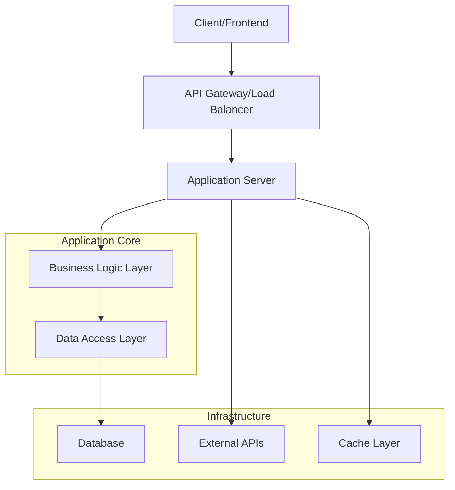
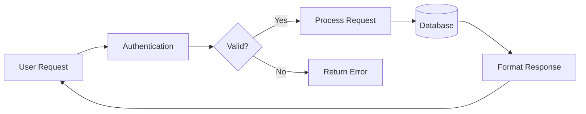
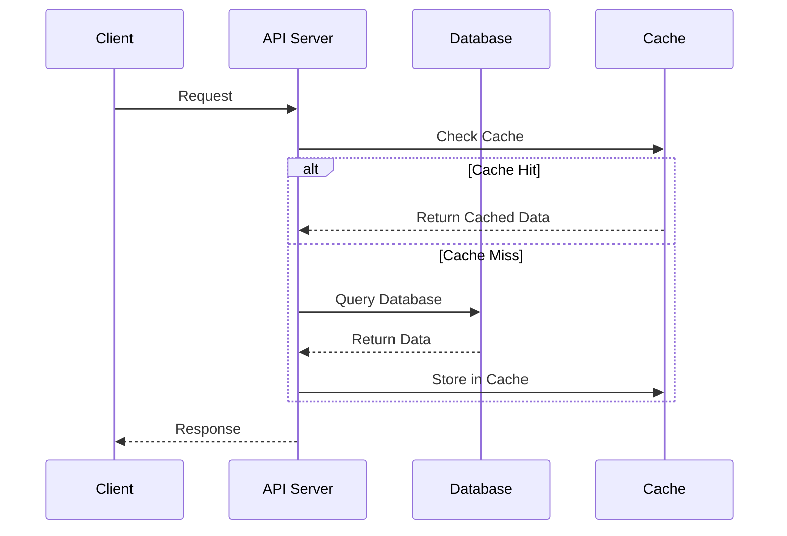
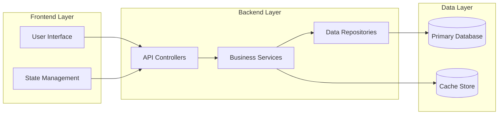

# Project Documentation Templates

This file contains all templates for the comprehensive project documentation system.

---

## Template 1: PROJECT-OVERVIEW.md

````markdown
# [PROJECT_NAME]

## Table of Contents

- [Project Overview](#project-overview)
- [Tech Stack](#tech-stack)
- [System Architecture](#system-architecture)
- [Key Features](#key-features)
- [Getting Started](#getting-started)
- [Related Documentation](#related-documentation)

## Project Overview

<!-- USER_INPUT: Project description and purpose -->

[PROJECT_DESCRIPTION]

**Purpose**: [PROJECT_PURPOSE]
**Target Users**: [TARGET_USERS]

## Tech Stack

<!-- DYNAMIC: Auto-detected from codebase analysis -->

### Core Technologies

- **Backend**: [BACKEND_TECH] <!-- Node.js, Python, Java, etc. -->
- **Frontend**: [FRONTEND_TECH] <!-- React, Vue, Angular, etc. -->
- **Database**: [DATABASE_TECH] <!-- PostgreSQL, MongoDB, etc. -->
- **Cache**: [CACHE_TECH] <!-- Redis, Memcached, etc. -->

### Development Tools

- **Package Manager**: [PACKAGE_MANAGER] <!-- npm, yarn, pip, etc. -->
- **Build Tool**: [BUILD_TOOL] <!-- Webpack, Vite, Maven, etc. -->
- **Testing**: [TESTING_FRAMEWORK] <!-- Jest, Pytest, JUnit, etc. -->
- **Code Quality**: [CODE_QUALITY_TOOLS] <!-- ESLint, Prettier, etc. -->

### Infrastructure

- **Containerization**: [CONTAINER_TECH] <!-- Docker, Kubernetes -->
- **Cloud Platform**: [CLOUD_PLATFORM] <!-- AWS, GCP, Azure -->
- **CI/CD**: [CICD_PLATFORM] <!-- GitHub Actions, Jenkins, etc. -->
- **Monitoring**: [MONITORING_TOOLS] <!-- Prometheus, DataDog, etc. -->

## System Architecture

<!-- DYNAMIC: Generated from project structure analysis -->

### System Overview



### Data Flow Diagram



### API Interaction Flow



### Component Dependencies



### Architectural Pattern

This project follows a **[ARCHITECTURE_PATTERN]** architecture with the following layers:

1. **[LAYER_1_NAME]** ([LAYER_1_PATH])
   - [LAYER_1_RESPONSIBILITY]
   - Key components: [LAYER_1_COMPONENTS]

2. **[LAYER_2_NAME]** ([LAYER_2_PATH])
   - [LAYER_2_RESPONSIBILITY]
   - Key components: [LAYER_2_COMPONENTS]

3. **[LAYER_3_NAME]** ([LAYER_3_PATH])
   - [LAYER_3_RESPONSIBILITY]
   - Key components: [LAYER_3_COMPONENTS]

4. **[LAYER_4_NAME]** ([LAYER_4_PATH])
   - [LAYER_4_RESPONSIBILITY]
   - Key components: [LAYER_4_COMPONENTS]

### Core Components

#### [COMPONENT_1_NAME]

**Location**: `[COMPONENT_1_PATH]`
**Purpose**: [COMPONENT_1_PURPOSE]
**Key Classes**: [COMPONENT_1_CLASSES]

#### [COMPONENT_2_NAME]

**Location**: `[COMPONENT_2_PATH]`
**Purpose**: [COMPONENT_2_PURPOSE]
**Key Classes**: [COMPONENT_2_CLASSES]

#### [COMPONENT_3_NAME]

**Location**: `[COMPONENT_3_PATH]`
**Purpose**: [COMPONENT_3_PURPOSE]
**Key Classes**: [COMPONENT_3_CLASSES]

## Key Features

<!-- USER_INPUT + DYNAMIC: From user input and code analysis -->

### [FEATURE_GROUP_1]

- **[FEATURE_1_1]**: [FEATURE_1_1_DESCRIPTION]
- **[FEATURE_1_2]**: [FEATURE_1_2_DESCRIPTION]
- **[FEATURE_1_3]**: [FEATURE_1_3_DESCRIPTION]

### [FEATURE_GROUP_2]

- **[FEATURE_2_1]**: [FEATURE_2_1_DESCRIPTION]
- **[FEATURE_2_2]**: [FEATURE_2_2_DESCRIPTION]
- **[FEATURE_2_3]**: [FEATURE_2_3_DESCRIPTION]

### [FEATURE_GROUP_3]

- **[FEATURE_3_1]**: [FEATURE_3_1_DESCRIPTION]
- **[FEATURE_3_2]**: [FEATURE_3_2_DESCRIPTION]
- **[FEATURE_3_3]**: [FEATURE_3_3_DESCRIPTION]

## Getting Started

For detailed setup instructions, see: [DEVELOPER-GUIDE.md](./DEVELOPER-GUIDE.md)

**Quick Start:**

```bash
[INSTALL_COMMAND]
[START_COMMAND]
```

## Related Documentation

- **[DEVELOPER-GUIDE.md](./DEVELOPER-GUIDE.md)** - Setup, installation, and development workflow
- **[CODING-STANDARDS.md](./CODING-STANDARDS.md)** - Code conventions and patterns
- **[CODEBASE-REFERENCE.md](./CODEBASE-REFERENCE.md)** - Complete code reference and API documentation
- **[LLM-CONTEXT.md](./LLM-CONTEXT.md)** - AI development context and patterns

---

**Last Updated**: [TIMESTAMP]
**Version**: [VERSION]
**Generated by**: Claude Code Assistant
````

---

## Template 2: DEVELOPER-GUIDE.md

````markdown
# Developer Guide

## Table of Contents

- [Quick Start](#quick-start)
- [Prerequisites](#prerequisites)
- [Installation](#installation)
- [Development Workflow](#development-workflow)
- [Testing](#testing)
- [Common Tasks](#common-tasks)
- [Troubleshooting](#troubleshooting)

## Quick Start

<!-- DYNAMIC: Generated from package.json scripts and setup -->

```bash
# Clone the repository
git clone [REPOSITORY_URL]
cd [PROJECT_NAME]

# Install dependencies
[INSTALL_COMMAND]

# Set up environment
[ENV_SETUP_COMMAND]

# Start development server
[DEV_START_COMMAND]
```
````

**Access the application:**

- **Frontend**: [FRONTEND_URL]
- **Backend API**: [BACKEND_URL]
- **Documentation**: [DOCS_URL]

## Prerequisites

<!-- DYNAMIC: Extracted from package.json engines and dependencies -->

### System Requirements

- **[RUNTIME_1]**: [VERSION_REQUIREMENT_1]
- **[RUNTIME_2]**: [VERSION_REQUIREMENT_2]
- **[DATABASE]**: [DATABASE_VERSION]
- **[ADDITIONAL_TOOL]**: [TOOL_VERSION]

### Development Tools

- **[TOOL_1]**: [TOOL_1_PURPOSE]
- **[TOOL_2]**: [TOOL_2_PURPOSE]
- **[TOOL_3]**: [TOOL_3_PURPOSE]

### Optional Tools

- **[OPTIONAL_TOOL_1]**: [OPTIONAL_TOOL_1_PURPOSE]
- **[OPTIONAL_TOOL_2]**: [OPTIONAL_TOOL_2_PURPOSE]

## Installation

<!-- DYNAMIC: Generated from package manager and setup scripts -->

### 1. Environment Setup

```bash
# [ENVIRONMENT_SETUP_DESCRIPTION]
[ENV_SETUP_COMMANDS]
```

### 2. Dependencies Installation

```bash
# [DEPENDENCY_INSTALLATION_DESCRIPTION]
[DEPENDENCY_COMMANDS]
```

### 3. Database Setup

```bash
# [DATABASE_SETUP_DESCRIPTION]
[DATABASE_COMMANDS]
```

### 4. Configuration

```bash
# [CONFIGURATION_DESCRIPTION]
[CONFIG_COMMANDS]
```

## Development Workflow

<!-- DYNAMIC: Generated from npm scripts and git workflows -->

### Daily Development

```bash
# Start development environment
[DEV_START_COMMAND]

# Run tests in watch mode
[TEST_WATCH_COMMAND]

# Code formatting
[FORMAT_COMMAND]

# Code linting
[LINT_COMMAND]
```

### Feature Development

1. **Create feature branch**: `[BRANCH_COMMAND]`
2. **Develop feature**: Follow coding standards
3. **Run tests**: `[TEST_COMMAND]`
4. **Create pull request**: Follow PR template
5. **Code review**: Address feedback
6. **Merge to main**: After approval

### Database Changes

```bash
# Create migration
[MIGRATION_CREATE_COMMAND]

# Run migrations
[MIGRATION_RUN_COMMAND]

# Rollback migration
[MIGRATION_ROLLBACK_COMMAND]
```

## Testing

<!-- DYNAMIC: Generated from test framework detection -->

### Test Types

- **Unit Tests**: [UNIT_TEST_DESCRIPTION]
- **Integration Tests**: [INTEGRATION_TEST_DESCRIPTION]
- **End-to-End Tests**: [E2E_TEST_DESCRIPTION]

### Running Tests

```bash
# Run all tests
[TEST_ALL_COMMAND]

# Run specific test suite
[TEST_SPECIFIC_COMMAND]

# Run tests with coverage
[TEST_COVERAGE_COMMAND]

# Run tests in watch mode
[TEST_WATCH_COMMAND]
```

### Test Coverage

- **Minimum Coverage**: [COVERAGE_THRESHOLD]%
- **Coverage Reports**: [COVERAGE_REPORT_LOCATION]

## Common Tasks

<!-- DYNAMIC: Generated from npm scripts and common operations -->

### Code Quality

```bash
# Format code
[FORMAT_COMMAND]

# Lint code
[LINT_COMMAND]

# Fix lint issues
[LINT_FIX_COMMAND]

# Type checking
[TYPE_CHECK_COMMAND]
```

### Database Operations

```bash
# Reset database
[DB_RESET_COMMAND]

# Seed database
[DB_SEED_COMMAND]

# Backup database
[DB_BACKUP_COMMAND]
```

### Debugging

```bash
# Start with debugger
[DEBUG_COMMAND]

# View logs
[LOGS_COMMAND]

# Performance profiling
[PROFILE_COMMAND]
```

## Troubleshooting

### Common Issues

1. **[ISSUE_1]**: [ISSUE_1_SOLUTION]
2. **[ISSUE_2]**: [ISSUE_2_SOLUTION]
3. **[ISSUE_3]**: [ISSUE_3_SOLUTION]

### Debug Commands

```bash
# Check system info
[SYSTEM_INFO_COMMAND]

# Clear cache
[CACHE_CLEAR_COMMAND]

# Reinstall dependencies
[REINSTALL_COMMAND]
```

## Template Instructions

**Format Guidelines for CODEBASE-REFERENCE.md Generation:**

1. **Detailed Format** (Use for 2-3 most critical items per section):
   - Full documentation with properties, methods, usage examples
   - Best for core classes, essential functions, main API endpoints
   - Provides comprehensive reference for key components

2. **Table Format** (Use for comprehensive coverage):
   - Concise tabular listing with Function/Location/Purpose/Signature
   - Best for utility functions, helper methods, secondary APIs
   - Allows listing many items without excessive detail

3. **Content Balance**:
   - **Class Inventory**: 3-5 key classes detailed + remaining in tables
   - **Function Catalog**: 3-4 critical functions detailed + utilities in tables
   - **API Endpoints**: 2-3 main endpoints detailed + others in tables
   - **Database Schema**: Key tables detailed + relationships overview

4. **Priority Guidelines**:
   - **High Priority**: Core business logic, main APIs, essential data structures
   - **Medium Priority**: Services, repositories, common utilities
   - **Low Priority**: Helper functions, configuration, constants

---

**Last Updated**: [TIMESTAMP]
**Version**: [VERSION]
**Generated by**: Claude Code Assistant

````

---

## Template 3: CODING-STANDARDS.md

```markdown
# Coding Standards

## Table of Contents

- [Naming Conventions](#naming-conventions)
- [File Organization](#file-organization)
- [Code Structure](#code-structure)
- [Error Handling](#error-handling)
- [Testing Standards](#testing-standards)

## Naming Conventions

<!-- DYNAMIC: Analyzed from actual codebase patterns -->

### Variables and Functions
- **Pattern**: [VARIABLE_NAMING_PATTERN] <!-- camelCase, snake_case, etc. -->
- **Examples**:
  - ✅ `[GOOD_VARIABLE_EXAMPLE]`
  - ❌ `[BAD_VARIABLE_EXAMPLE]`

### Classes and Interfaces
- **Pattern**: [CLASS_NAMING_PATTERN] <!-- PascalCase, etc. -->
- **Examples**:
  - ✅ `[GOOD_CLASS_EXAMPLE]`
  - ❌ `[BAD_CLASS_EXAMPLE]`

### Files and Directories
- **Pattern**: [FILE_NAMING_PATTERN] <!-- kebab-case, camelCase, etc. -->
- **Examples**:
  - ✅ `[GOOD_FILE_EXAMPLE]`
  - ❌ `[BAD_FILE_EXAMPLE]`

### Constants and Enums
- **Pattern**: [CONSTANT_NAMING_PATTERN] <!-- UPPER_SNAKE_CASE, etc. -->
- **Examples**:
  - ✅ `[GOOD_CONSTANT_EXAMPLE]`
  - ❌ `[BAD_CONSTANT_EXAMPLE]`

### Database and API Naming
- **Tables**: [TABLE_NAMING_PATTERN] <!-- snake_case, etc. -->
- **Columns**: [COLUMN_NAMING_PATTERN] <!-- snake_case, etc. -->
- **Endpoints**: [ENDPOINT_NAMING_PATTERN] <!-- kebab-case, etc. -->

## File Organization

<!-- DYNAMIC: Generated from project structure analysis -->

### Project Structure
````

[PROJECT_ROOT]/
├── [SOURCE_FOLDER]/ # [SOURCE_FOLDER_PURPOSE]
│ ├── [COMPONENT_FOLDER_1]/ # [COMPONENT_1_PURPOSE]
│ │ ├── [COMPONENT_1_FILE_1]
│ │ ├── [COMPONENT_1_FILE_2]
│ │ └── index.[EXT]
│ ├── [COMPONENT_FOLDER_2]/ # [COMPONENT_2_PURPOSE]
│ │ ├── [COMPONENT_2_FILE_1]
│ │ ├── [COMPONENT_2_FILE_2]
│ │ └── index.[EXT]
│ └── [SHARED_FOLDER]/ # [SHARED_FOLDER_PURPOSE]
│ ├── [SHARED_FILE_1]
│ └── [SHARED_FILE_2]
├── [TEST_FOLDER]/ # [TEST_FOLDER_PURPOSE]
├── [CONFIG_FOLDER]/ # [CONFIG_FOLDER_PURPOSE]
└── [DOCS_FOLDER]/ # [DOCS_FOLDER_PURPOSE]

````

### File Organization Rules
1. **[ORGANIZATION_RULE_1]**: [RULE_1_DESCRIPTION]
2. **[ORGANIZATION_RULE_2]**: [RULE_2_DESCRIPTION]
3. **[ORGANIZATION_RULE_3]**: [RULE_3_DESCRIPTION]

### Import Organization
```[LANGUAGE]
// [COMMENT_STYLE] 1. Standard library imports
[STANDARD_IMPORT_EXAMPLE]

// [COMMENT_STYLE] 2. Third-party library imports
[THIRD_PARTY_IMPORT_EXAMPLE]

// [COMMENT_STYLE] 3. Internal imports (absolute)
[INTERNAL_ABSOLUTE_IMPORT_EXAMPLE]

// [COMMENT_STYLE] 4. Relative imports
[RELATIVE_IMPORT_EXAMPLE]
````

## Code Structure

<!-- DYNAMIC: Patterns detected from codebase analysis -->

### Function Structure

```[LANGUAGE]
/**
 * [FUNCTION_DESCRIPTION]
 * @param {[PARAM_TYPE]} [PARAM_NAME] - [PARAM_DESCRIPTION]
 * @returns {[RETURN_TYPE]} [RETURN_DESCRIPTION]
 */
[FUNCTION_SIGNATURE] {
    // [VALIDATION_PATTERN]
    [VALIDATION_EXAMPLE]

    // [MAIN_LOGIC_PATTERN]
    [MAIN_LOGIC_EXAMPLE]

    // [RETURN_PATTERN]
    [RETURN_EXAMPLE]
}
```

### Class Structure

```[LANGUAGE]
/**
 * [CLASS_DESCRIPTION]
 */
class [CLASS_NAME] {
    // [PROPERTY_PATTERN]
    [PROPERTY_EXAMPLE]

    /**
     * [CONSTRUCTOR_DESCRIPTION]
     */
    constructor([CONSTRUCTOR_PARAMS]) {
        [CONSTRUCTOR_BODY]
    }

    // [PUBLIC_METHOD_PATTERN]
    [PUBLIC_METHOD_EXAMPLE]

    // [PRIVATE_METHOD_PATTERN]
    [PRIVATE_METHOD_EXAMPLE]
}
```

### Module Structure

```[LANGUAGE]
[MODULE_HEADER_COMMENT]

[IMPORTS_SECTION]

[CONSTANTS_SECTION]

[TYPES_SECTION]

[MAIN_IMPLEMENTATION]

[EXPORTS_SECTION]
```

## Error Handling

<!-- DYNAMIC: Patterns detected from existing error handling -->

### Error Types

- **[ERROR_TYPE_1]**: [ERROR_TYPE_1_USAGE]
- **[ERROR_TYPE_2]**: [ERROR_TYPE_2_USAGE]
- **[ERROR_TYPE_3]**: [ERROR_TYPE_3_USAGE]

### Error Handling Pattern

```[LANGUAGE]
try {
    [OPERATION_EXAMPLE]
} catch ([ERROR_VARIABLE]) {
    [ERROR_HANDLING_PATTERN]
    [LOGGING_PATTERN]
    [ERROR_RESPONSE_PATTERN]
}
```

### Custom Error Classes

```[LANGUAGE]
class [CUSTOM_ERROR_CLASS] extends [BASE_ERROR_CLASS] {
    constructor([ERROR_PARAMS]) {
        super([SUPER_PARAMS]);
        [CUSTOM_ERROR_PROPERTIES]
    }
}
```

### Error Response Format

```[LANGUAGE]
{
    "error": {
        "code": "[ERROR_CODE]",
        "message": "[ERROR_MESSAGE]",
        "details": [ERROR_DETAILS],
        "timestamp": "[TIMESTAMP]"
    }
}
```

## Testing Standards

<!-- DYNAMIC: Testing patterns detected from test files -->

### Test File Organization

```
[TEST_FOLDER]/
├── [UNIT_TEST_FOLDER]/
│   ├── [UNIT_TEST_FILE_1]
│   └── [UNIT_TEST_FILE_2]
├── [INTEGRATION_TEST_FOLDER]/
│   ├── [INTEGRATION_TEST_FILE_1]
│   └── [INTEGRATION_TEST_FILE_2]
└── [E2E_TEST_FOLDER]/
    ├── [E2E_TEST_FILE_1]
    └── [E2E_TEST_FILE_2]
```

### Test Structure

```[LANGUAGE]
[TEST_IMPORT_EXAMPLE]

describe('[TEST_SUITE_NAME]', () => {
    [TEST_SETUP_EXAMPLE]

    [TEST_TEARDOWN_EXAMPLE]

    test('[TEST_CASE_NAME]', () => {
        // Arrange
        [ARRANGE_EXAMPLE]

        // Act
        [ACT_EXAMPLE]

        // Assert
        [ASSERT_EXAMPLE]
    });
});
```

### Test Coverage Requirements

- **Minimum Coverage**: [COVERAGE_THRESHOLD]%
- **Critical Components**: [CRITICAL_COVERAGE_THRESHOLD]%
- **Test Types Required**: [REQUIRED_TEST_TYPES]

---

**Last Updated**: [TIMESTAMP]
**Version**: [VERSION]
**Generated by**: Claude Code Assistant

````

---

## Template 4: CODEBASE-REFERENCE.md

```markdown
# Codebase Reference

Quick reference for LLM assistants to reuse existing code components.

## Class Inventory

<!-- DYNAMIC: Auto-generated from AST parsing -->

### [CATEGORY_1_NAME]

| Class | Location | Purpose | Key Methods |
|-------|----------|---------|-------------|
| `[CLASS_1_NAME]` | `[CLASS_1_PATH]` | [CLASS_1_PURPOSE] | `[METHOD_1]`, `[METHOD_2]`, `[METHOD_3]` |
| `[CLASS_2_NAME]` | `[CLASS_2_PATH]` | [CLASS_2_PURPOSE] | `[METHOD_1]`, `[METHOD_2]`, `[METHOD_3]` |
| `[CLASS_3_NAME]` | `[CLASS_3_PATH]` | [CLASS_3_PURPOSE] | `[METHOD_1]`, `[METHOD_2]`, `[METHOD_3]` |

### [CATEGORY_2_NAME]

| Class | Location | Purpose | Key Methods |
|-------|----------|---------|-------------|
| `[CLASS_4_NAME]` | `[CLASS_4_PATH]` | [CLASS_4_PURPOSE] | `[METHOD_1]`, `[METHOD_2]`, `[METHOD_3]` |
| `[CLASS_5_NAME]` | `[CLASS_5_PATH]` | [CLASS_5_PURPOSE] | `[METHOD_1]`, `[METHOD_2]`, `[METHOD_3]` |
| `[CLASS_6_NAME]` | `[CLASS_6_PATH]` | [CLASS_6_PURPOSE] | `[METHOD_1]`, `[METHOD_2]`, `[METHOD_3]` |

## Function Catalog

<!-- DYNAMIC: Auto-generated from function analysis -->

### [FUNCTION_CATEGORY_1]

| Function | Location | Purpose | Signature |
|----------|----------|---------|-----------|
| `[FUNCTION_1_NAME]` | `[FUNCTION_1_PATH]` | [FUNCTION_1_PURPOSE] | `[FUNCTION_1_SIGNATURE]` |
| `[FUNCTION_2_NAME]` | `[FUNCTION_2_PATH]` | [FUNCTION_2_PURPOSE] | `[FUNCTION_2_SIGNATURE]` |
| `[FUNCTION_3_NAME]` | `[FUNCTION_3_PATH]` | [FUNCTION_3_PURPOSE] | `[FUNCTION_3_SIGNATURE]` |

### [FUNCTION_CATEGORY_2] 

| Function | Location | Purpose | Signature |
|----------|----------|---------|-----------|
| `[FUNCTION_4_NAME]` | `[FUNCTION_4_PATH]` | [FUNCTION_4_PURPOSE] | `[FUNCTION_4_SIGNATURE]` |
| `[FUNCTION_5_NAME]` | `[FUNCTION_5_PATH]` | [FUNCTION_5_PURPOSE] | `[FUNCTION_5_SIGNATURE]` |
| `[FUNCTION_6_NAME]` | `[FUNCTION_6_PATH]` | [FUNCTION_6_PURPOSE] | `[FUNCTION_6_SIGNATURE]` |

### [FUNCTION_CATEGORY_3]

| Function | Location | Purpose | Signature |
|----------|----------|---------|-----------|
| `[FUNCTION_7_NAME]` | `[FUNCTION_7_PATH]` | [FUNCTION_7_PURPOSE] | `[FUNCTION_7_SIGNATURE]` |
| `[FUNCTION_8_NAME]` | `[FUNCTION_8_PATH]` | [FUNCTION_8_PURPOSE] | `[FUNCTION_8_SIGNATURE]` |
| `[FUNCTION_9_NAME]` | `[FUNCTION_9_PATH]` | [FUNCTION_9_PURPOSE] | `[FUNCTION_9_SIGNATURE]` |

## API Endpoints

<!-- DYNAMIC: Auto-generated from route analysis -->

### [API_GROUP_1]

| Method | Endpoint | Purpose | Auth |
|--------|----------|---------|------|
| `[METHOD_1]` | `[ENDPOINT_1_PATH]` | [ENDPOINT_1_PURPOSE] | [AUTH_1] |
| `[METHOD_2]` | `[ENDPOINT_2_PATH]` | [ENDPOINT_2_PURPOSE] | [AUTH_2] |
| `[METHOD_3]` | `[ENDPOINT_3_PATH]` | [ENDPOINT_3_PURPOSE] | [AUTH_3] |

### [API_GROUP_2]

| Method | Endpoint | Purpose | Auth |
|--------|----------|---------|------|
| `[METHOD_4]` | `[ENDPOINT_4_PATH]` | [ENDPOINT_4_PURPOSE] | [AUTH_4] |
| `[METHOD_5]` | `[ENDPOINT_5_PATH]` | [ENDPOINT_5_PURPOSE] | [AUTH_5] |
| `[METHOD_6]` | `[ENDPOINT_6_PATH]` | [ENDPOINT_6_PURPOSE] | [AUTH_6] |

## Database Schema

<!-- DYNAMIC: Auto-generated from database analysis -->

### Main Tables

| Table | Purpose | Key Columns | Relationships |
|-------|---------|-------------|---------------|
| `[TABLE_1_NAME]` | [TABLE_1_PURPOSE] | `[KEY_COLUMNS_1]` | [RELATIONSHIPS_1] |
| `[TABLE_2_NAME]` | [TABLE_2_PURPOSE] | `[KEY_COLUMNS_2]` | [RELATIONSHIPS_2] |
| `[TABLE_3_NAME]` | [TABLE_3_PURPOSE] | `[KEY_COLUMNS_3]` | [RELATIONSHIPS_3] |

## Constants & Utilities

<!-- DYNAMIC: Auto-generated from constants analysis -->

### Application Constants

```[LANGUAGE]
// [CONSTANT_CATEGORY_1]
[CONSTANT_1_NAME] = [CONSTANT_1_VALUE]; // [CONSTANT_1_DESCRIPTION]
[CONSTANT_2_NAME] = [CONSTANT_2_VALUE]; // [CONSTANT_2_DESCRIPTION]

// [CONSTANT_CATEGORY_2] 
[CONSTANT_3_NAME] = [CONSTANT_3_VALUE]; // [CONSTANT_3_DESCRIPTION]
[CONSTANT_4_NAME] = [CONSTANT_4_VALUE]; // [CONSTANT_4_DESCRIPTION]
```

---

**Last Updated**: [TIMESTAMP]
**Generated by**: Claude Code Assistant

````

---

## Template 5: LLM-CONTEXT.md

```markdown
# LLM Context & Development Patterns

## Table of Contents

- [Project Context](#project-context)
- [Domain Terminology](#domain-terminology)
- [Code Patterns to Follow](#code-patterns-to-follow)
- [Reusable Components](#reusable-components)
- [Business Rules & Constraints](#business-rules--constraints)
- [Quick Reference](#quick-reference)

## Project Context

### AI Development Guidelines
This document provides context for AI assistants working on this codebase. Always refer to this file for:
- **Domain-specific terminology** and business concepts
- **Code patterns** that should be consistently followed
- **Reusable functions** and components to avoid duplication
- **Business rules** and constraints that must be respected

### Key Principles for AI Development
1. **Reuse First**: Always check existing functions before implementing new ones
2. **Follow Patterns**: Use established patterns for consistency
3. **Respect Constraints**: Adhere to business rules and technical limitations
4. **Maintain Quality**: Follow coding standards and testing requirements

## Domain Terminology

<!-- DYNAMIC: Extracted from codebase and user context -->

### Business Terms
- **[BUSINESS_TERM_1]**: [BUSINESS_TERM_1_DEFINITION]
  - **Usage**: [USAGE_EXAMPLE_1]
  - **Related Code**: `[RELATED_CODE_1]`

- **[BUSINESS_TERM_2]**: [BUSINESS_TERM_2_DEFINITION]
  - **Usage**: [USAGE_EXAMPLE_2]
  - **Related Code**: `[RELATED_CODE_2]`

- **[BUSINESS_TERM_3]**: [BUSINESS_TERM_3_DEFINITION]
  - **Usage**: [USAGE_EXAMPLE_3]
  - **Related Code**: `[RELATED_CODE_3]`

### Technical Terms
- **[TECHNICAL_TERM_1]**: [TECHNICAL_TERM_1_DEFINITION]
- **[TECHNICAL_TERM_2]**: [TECHNICAL_TERM_2_DEFINITION]
- **[TECHNICAL_TERM_3]**: [TECHNICAL_TERM_3_DEFINITION]

### Common Abbreviations
- **[ABBREVIATION_1]**: [ABBREVIATION_1_MEANING]
- **[ABBREVIATION_2]**: [ABBREVIATION_2_MEANING]
- **[ABBREVIATION_3]**: [ABBREVIATION_3_MEANING]

## Code Patterns to Follow

<!-- DYNAMIC: Patterns extracted from codebase analysis -->

### Service Layer Pattern
```[LANGUAGE]
// ✅ Always use this pattern for service classes
class [SERVICE_CLASS_NAME] {
    constructor([DEPENDENCIES]) {
        [DEPENDENCY_INJECTION_PATTERN]
    }

    async [METHOD_NAME]([PARAMETERS]) {
        [VALIDATION_PATTERN]

        [BUSINESS_LOGIC_PATTERN]

        [RETURN_PATTERN]
    }
}
````

### Repository Pattern

```[LANGUAGE]
// ✅ Always use this pattern for data access
class [REPOSITORY_CLASS_NAME] {
    constructor([DATABASE_CONNECTION]) {
        [INITIALIZATION_PATTERN]
    }

    async [CRUD_METHOD]([PARAMETERS]) {
        [QUERY_PATTERN]

        [ERROR_HANDLING_PATTERN]

        [RETURN_PATTERN]
    }
}
```

### Controller Pattern

```[LANGUAGE]
// ✅ Always use this pattern for API controllers
class [CONTROLLER_CLASS_NAME] {
    constructor([SERVICES]) {
        [SERVICE_INJECTION_PATTERN]
    }

    async [ENDPOINT_METHOD]([REQUEST], [RESPONSE]) {
        [REQUEST_VALIDATION_PATTERN]

        [SERVICE_CALL_PATTERN]

        [RESPONSE_PATTERN]
    }
}
```

### Error Handling Pattern

```[LANGUAGE]
// ✅ Always use this pattern for error handling
try {
    [OPERATION]
} catch ([ERROR_VARIABLE]) {
    [LOGGING_PATTERN]

    [ERROR_CLASSIFICATION_PATTERN]

    [ERROR_RESPONSE_PATTERN]
}
```

## Reusable Components

<!-- DYNAMIC: Extracted from codebase analysis -->

### Utility Functions

```[LANGUAGE]
// ✅ Always use these existing utilities

// Date/Time utilities
[DATE_UTILITY_EXAMPLE]

// Validation utilities
[VALIDATION_UTILITY_EXAMPLE]

// String utilities
[STRING_UTILITY_EXAMPLE]

// Data transformation utilities
[TRANSFORMATION_UTILITY_EXAMPLE]
```

### Common Services

```[LANGUAGE]
// ✅ Always use these existing services

// [SERVICE_1_NAME] - [SERVICE_1_PURPOSE]
[SERVICE_1_USAGE_EXAMPLE]

// [SERVICE_2_NAME] - [SERVICE_2_PURPOSE]
[SERVICE_2_USAGE_EXAMPLE]

// [SERVICE_3_NAME] - [SERVICE_3_PURPOSE]
[SERVICE_3_USAGE_EXAMPLE]
```

### Middleware Components

```[LANGUAGE]
// ✅ Always use these existing middleware

// Authentication middleware
[AUTH_MIDDLEWARE_USAGE]

// Validation middleware
[VALIDATION_MIDDLEWARE_USAGE]

// Logging middleware
[LOGGING_MIDDLEWARE_USAGE]
```

### Database Helpers

```[LANGUAGE]
// ✅ Always use these existing database helpers

// Query builders
[QUERY_BUILDER_USAGE]

// Transaction helpers
[TRANSACTION_HELPER_USAGE]

// Migration helpers
[MIGRATION_HELPER_USAGE]
```

## Business Rules & Constraints

<!-- DYNAMIC: Extracted from codebase and user context -->

### Data Validation Rules

1. **[VALIDATION_RULE_1]**: [RULE_1_DESCRIPTION]
   - **Implementation**: `[VALIDATION_FUNCTION_1]`
   - **Error Message**: "[ERROR_MESSAGE_1]"

2. **[VALIDATION_RULE_2]**: [RULE_2_DESCRIPTION]
   - **Implementation**: `[VALIDATION_FUNCTION_2]`
   - **Error Message**: "[ERROR_MESSAGE_2]"

3. **[VALIDATION_RULE_3]**: [RULE_3_DESCRIPTION]
   - **Implementation**: `[VALIDATION_FUNCTION_3]`
   - **Error Message**: "[ERROR_MESSAGE_3]"

### Business Logic Constraints

1. **[BUSINESS_CONSTRAINT_1]**: [CONSTRAINT_1_DESCRIPTION]
   - **Code Example**: `[CONSTRAINT_1_CODE]`

2. **[BUSINESS_CONSTRAINT_2]**: [CONSTRAINT_2_DESCRIPTION]
   - **Code Example**: `[CONSTRAINT_2_CODE]`

3. **[BUSINESS_CONSTRAINT_3]**: [CONSTRAINT_3_DESCRIPTION]
   - **Code Example**: `[CONSTRAINT_3_CODE]`

### Security Constraints

1. **[SECURITY_CONSTRAINT_1]**: [SECURITY_1_DESCRIPTION]
2. **[SECURITY_CONSTRAINT_2]**: [SECURITY_2_DESCRIPTION]
3. **[SECURITY_CONSTRAINT_3]**: [SECURITY_3_DESCRIPTION]

## Quick Reference

### Most Common Functions

```[LANGUAGE]
// Input validation
[MOST_USED_VALIDATION_FUNCTION]

// Data formatting
[MOST_USED_FORMATTING_FUNCTION]

// Error handling
[MOST_USED_ERROR_FUNCTION]

// Database operations
[MOST_USED_DATABASE_FUNCTION]

// API responses
[MOST_USED_RESPONSE_FUNCTION]
```

### Environment Variables

```bash
# Database
[DATABASE_ENV_VARS]

# Authentication
[AUTH_ENV_VARS]

# External services
[EXTERNAL_SERVICE_ENV_VARS]

# Application settings
[APP_CONFIG_ENV_VARS]
```

### Common Commands

```bash
# Development
[DEV_COMMAND_1]
[DEV_COMMAND_2]

# Testing
[TEST_COMMAND_1]
[TEST_COMMAND_2]

# Database
[DB_COMMAND_1]
[DB_COMMAND_2]

# Deployment
[DEPLOY_COMMAND_1]
[DEPLOY_COMMAND_2]
```

### Key Configuration Files

- **[CONFIG_FILE_1]**: [CONFIG_1_PURPOSE]
- **[CONFIG_FILE_2]**: [CONFIG_2_PURPOSE]
- **[CONFIG_FILE_3]**: [CONFIG_3_PURPOSE]

---

**Important Notes for AI Development:**

1. Always check this file before implementing new features
2. Reuse existing functions and patterns whenever possible
3. Follow the established code patterns and business rules
4. When in doubt, ask for clarification on business requirements
5. Always test your code and handle errors appropriately

**Last Updated**: [TIMESTAMP]
**Version**: [VERSION]
**Generated by**: Claude Code Assistant

```

```
