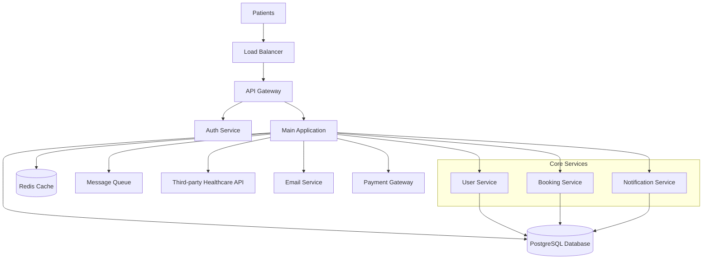
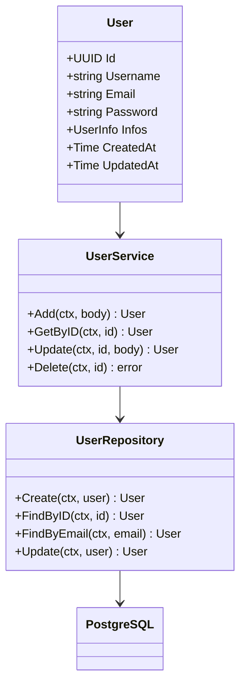
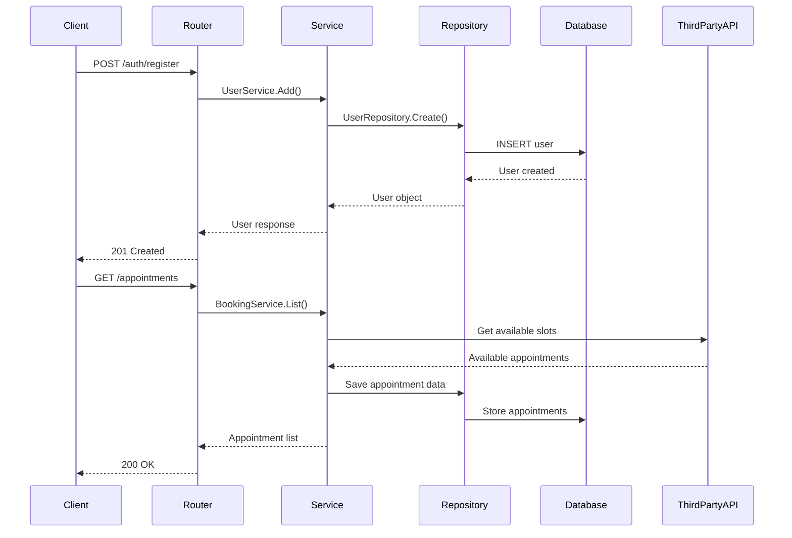

# Venera Healthcare Booking Service

## Table of Contents

- [Project Overview](#project-overview)
- [Business Context](#business-context)
- [Tech Stack](#tech-stack)
- [System Architecture](#system-architecture)
- [Key Features](#key-features)
- [Integration Points](#integration-points)
- [Deployment Strategy](#deployment-strategy)
- [Architecture Diagrams](#architecture-diagrams)
- [Getting Started](#getting-started)
- [Related Documentation](#related-documentation)

## Project Overview

**Venera Healthcare Booking Service** is a backend API system designed to facilitate medical appointment booking for healthcare providers. The system enables patients to schedule appointments through third-party API integrations and provides comprehensive appointment management capabilities.

**Purpose**: Streamline healthcare appointment booking process through API-driven solutions
**Target Users**: Healthcare providers, patients, third-party healthcare platforms
**Main Goals**: 
- Simplify appointment scheduling for patients
- Integrate with third-party healthcare APIs
- Provide reliable appointment management system
- Support healthcare provider workflow optimization

## Business Context

**Domain**: Healthcare Technology
**Industry**: Medical Services & Healthcare IT
**Key Stakeholders**: Healthcare providers, patients, medical staff, third-party service providers

**Business Rules**:
- Patient registration required before booking appointments
- Appointment scheduling through third-party API integration
- User authentication and authorization for all operations
- Secure handling of patient information (HIPAA compliance considerations)
- Real-time appointment availability checking

**Success Metrics**:
- Appointment booking success rate
- API response time performance
- Patient user registration rate
- Third-party API integration reliability
- System uptime and availability

## Tech Stack

### Core Technologies

- **Backend**: Go 1.24.4 (Chi router framework)
- **Database**: PostgreSQL (with JSONB support)
- **Authentication**: JWT-based authentication (planned)
- **API Framework**: Chi v5 HTTP router
- **Logging**: Zerolog structured logging

### Development Tools

- **Package Manager**: Go modules
- **Build Tool**: Go native build tools
- **Configuration**: Viper configuration management
- **Database Driver**: pgx/v5 PostgreSQL driver
- **Development Tools**: Air (live reload), golangci-lint, goimports, gofumpt

### Infrastructure

- **Database**: PostgreSQL with UUID primary keys
- **Migration System**: SQL-based migrations
- **Containerization**: Docker support (planned)
- **Environment Management**: YAML-based configuration
- **API Documentation**: Swagger/OpenAPI (planned)

## System Architecture

### Architectural Pattern

This project follows a **Clean Architecture** pattern with the following layers:

1. **Presentation Layer** (`internal/router/`)
   - HTTP route handlers and middleware
   - Key components: Auth router, User router

2. **Service Layer** (`internal/service/`)
   - Business logic and orchestration
   - Key components: User service, Database service

3. **Repository Layer** (`internal/repository/`)
   - Data access and persistence
   - Key components: User repository, PostgreSQL repository

4. **Domain Layer** (`internal/model/`)
   - Business entities and domain objects
   - Key components: User model, DTO objects

### Core Components

#### Authentication Module
**Location**: `internal/router/auth.go`
**Purpose**: Handle user authentication and registration
**Key Classes**: Auth router, authentication middleware

#### User Management
**Location**: `internal/service/user.go`, `internal/repository/user.go`
**Purpose**: Manage patient user accounts and information
**Key Classes**: User service, User repository

#### Database Layer
**Location**: `internal/service/postgres.go`, `pkg/db/`
**Purpose**: Database connection pooling and query operations
**Key Classes**: PostgreSQL service, Database pool management

## Key Features

### User Management
- **User Registration**: Patient account creation with validation
- **User Authentication**: Secure login system (in development)
- **User Profile Management**: Patient information storage with JSONB support

### Appointment Booking (Planned)
- **Appointment Scheduling**: Integration with third-party healthcare APIs
- **Appointment Listing**: Display available appointment slots
- **Appointment Management**: CRUD operations for appointments

### System Features
- **Request Logging**: Comprehensive request/response logging
- **Error Handling**: Structured error responses
- **Data Validation**: Input validation with custom validators
- **Database Migrations**: Version-controlled database schema changes

## Integration Points

### External APIs
- **Third-party Healthcare APIs**: Appointment booking integration (planned)
- **Email Service**: User notification system (planned)
- **Payment Gateway**: Appointment payment processing (planned)

### Third-Party Services
- **Database Service**: PostgreSQL with connection pooling
- **Logging Service**: Structured logging with Zerolog
- **Configuration Service**: Environment-based configuration

### Database Connections
- **Primary DB**: PostgreSQL with UUID primary keys
- **Connection Pool**: pgx/v5 with connection pooling
- **Migration System**: SQL-based database migrations

## Deployment Strategy

### Environments
- **Development**: Local development with live reload
- **Staging**: Pre-production testing environment (planned)
- **Production**: Production deployment (planned)

### Deployment Process
1. **Build Process**: Go native build with make commands
2. **Testing Pipeline**: Unit and integration tests (planned)
3. **Deployment Method**: Docker containerization (planned)
4. **Monitoring**: Structured logging and health checks

### Infrastructure
- **Hosting**: Cloud deployment (planned)
- **Load Balancing**: Reverse proxy configuration (planned)
- **SSL/Security**: HTTPS with proper certificate management
- **Backup Strategy**: Database backup and recovery procedures

## Architecture Diagrams

### System Overview



### Component Architecture



### Data Flow



## Getting Started

For detailed setup instructions, see: [DEVELOPER-GUIDE.md](./DEVELOPER-GUIDE.md)

**Quick Start:**

```bash
# Clone repository
git clone https://github.com/venera-ai/backend.git

# Install development tools
make tools

# Create environment configuration
# Create .env.yaml file (see internal/initialize/consts.go)

# Start development server
make server

# Or use live reload
make air
```

## Related Documentation

- **[DEVELOPER-GUIDE.md](./DEVELOPER-GUIDE.md)** - Setup, installation, and development workflow
- **[CODING-STANDARDS.md](./CODING-STANDARDS.md)** - Go code conventions and patterns
- **[CODEBASE-REFERENCE.md](./CODEBASE-REFERENCE.md)** - Complete code reference and API documentation
- **[DEPENDENCIES-GUIDE.md](./DEPENDENCIES-GUIDE.md)** - Go modules and external services
- **[LLM-CONTEXT.md](./LLM-CONTEXT.md)** - Healthcare domain context and development patterns

---

**Last Updated**: 2025-07-16
**Version**: 1.0.0
**Generated by**: Claude Code Assistant