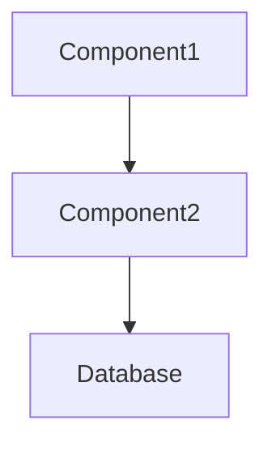

# Templates Reference

## Document Templates

### BUSINESS-CONTEXT.md Template
```markdown
# Project Goal
[Problem this codebase solves]

# Domain Logic
- [Business rule 1]
- [Business rule 2]

# User Flows
- [Use case 1]: [brief flow]
- [Use case 2]: [brief flow]
```

### ARCHITECTURE.md Template
```markdown
# Tech Stack Roles
- [Tech 1] → [role]
- [Tech 2] → [role]

# Component Roles
- [Component 1] → [responsibility]
- [Component 2] → [responsibility]

# System Interactions

```

### CODEBASE-MAP.md Template
```markdown
# Tech Stack + Versions
- [Framework 1] [version]
- [Database] [version]

# Components

## ComponentName (src/path/file.ts:15)
├─ ClassName (line X)
│  ├─ method1() → action description
│  └─ method2() → action description
└─ ClassName2 (line Y)
   └─ methodA() → action description
```

### PATTERNS-CONVENTIONS.md Template
```markdown
# Naming Patterns
- **Files**: [convention]
- **Classes**: [convention]
- **Methods**: [convention]

# Code Patterns
- **Error Handling**: [pattern]
- **Data Validation**: [approach]

# Architecture Patterns
- **Component Structure**: [organization]
- **Data Flow**: [movement]
```

## Planning Template
```markdown
# [FEATURE_NAME]

## High-Level Architecture
[Component overview and relationships]

## [Component 1]

### Purpose
[Problem this component solves]

### Requirements
- [requirement 1]
- [requirement 2]

### Integration
- Uses: [components]
- Provides: [interfaces]

## Architecture Decisions
[Key technical decisions]
```

## Tasks Template
```markdown
# [FEATURE_NAME] Tasks

← Planning: `.claude/custom/planning/[same-filename].md`

## High-Level Implementation
- [ ] [Major component 1]
- [ ] [Major component 2]
- [ ] [Integration points]
- [ ] [Testing approach]

## [ComponentName] Methods
**Target**: `src/path/ComponentFile.ts`

- [ ] methodName() → short description
  - Reference: ComponentFile.ts:25-35
  - Dependencies: @OtherService.method
- [ ] anotherMethod(param: Type) → description
  - Reference: ComponentFile.ts:40-55
  - Uses: existing utilities

## Integration Tasks
- [ ] Connect ComponentA → ComponentB
- [ ] Database schema updates
- [ ] API endpoint modifications
- [ ] Update existing tests
```