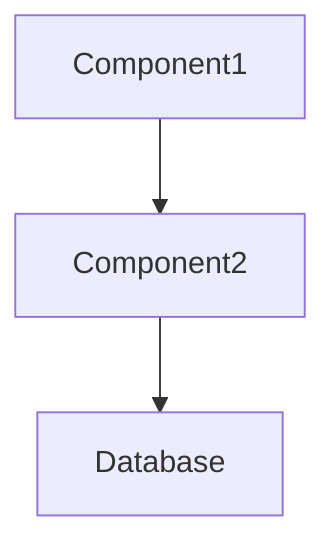

# Project Overview Mode - Detailed Guide

## Purpose

Generate/update 4 essential documentation files for LLM quick understanding of codebase. Foundation mode for all projects.

## Process

1. **Ask for project description** (USP): "Please describe this project: (Leave empty for auto-detection)"
2. **Process user input**: Use user's description OR auto-detect if empty
3. Check existing docs files → **Ask update preference** (USP)
4. Smart codebase scan
5. Generate 4 files
6. Apply update logic (preserve manual sections)

## Target Files

```
.claude/custom/docs
├── BUSINESS-CONTEXT.md     # Goals, domain, business logic
├── ARCHITECTURE.md         # Tech roles, component roles, interactions
├── CODEBASE-MAP.md        # Versions, components, classes, methods
└── PATTERNS-CONVENTIONS.md # Coding patterns, naming rules
```

## Codebase Scanning

### Tech Stack Detection

- List all paths (exclude .gitignore)
- Auto-detect tech stack files and patterns
- Extract versions and dependencies
- Infer roles from usage patterns

### Project Purpose Auto-Detection (when user input empty)

- Analyze README.md, package.json, main entry files
- Examine API endpoints, routes, database schemas
- Review component names and business logic patterns
- Infer domain and use cases from code structure

### Component Discovery

- Auto-analyze structure, naming, imports, content
- Identify logical components from file organization
- Infer roles from actual usage in codebase
- Group by natural project architecture

### Code Extraction

- AST parsing for accurate structure
- Method signatures with parameters/types
- Line number references
- Extract comments for descriptions

## File Templates

### BUSINESS-CONTEXT.md

```markdown
# Project Goal

[Problem this codebase solves]

# Domain Logic

- [Business rule 1]
- [Business rule 2]

# User Flows

- [Use case 1]: [brief flow]
- [Use case 2]: [brief flow]
```

### ARCHITECTURE.md

````markdown
# Tech Stack Roles

- [Tech 1] → [role]
- [Tech 2] → [role]

# Component Roles

- [Component 1] → [responsibility]
- [Component 2] → [responsibility]

# System Interactions


````

````

### CODEBASE-MAP.md
```markdown
# Tech Stack + Versions
- [Framework 1] [version]
- [Database] [version]

# Components

## ComponentName (src/path/file.ts:15)
├─ ClassName (line X)
│  ├─ method1() → action description
│  └─ method2() → action description
└─ ClassName2 (line Y)
   └─ methodA() → action description
````

### PATTERNS-CONVENTIONS.md

```markdown
# Naming Patterns

- **Files**: [convention]
- **Classes**: [convention]
- **Methods**: [convention]

# Code Patterns

- **Error Handling**: [pattern]
- **Data Validation**: [approach]

# Architecture Patterns

- **Component Structure**: [organization]
- **Data Flow**: [movement]
```

## Update Logic

### Content Classification

- `<!-- AUTO-GENERATED -->` sections: Safe to update
- `<!-- MANUAL -->` sections: Preserve user edits
- Auto-add new components, auto-delete removed ones
- Update signatures, preserve custom descriptions

### Change Detection

```
✅ Component.method() - matches docs
❌ Component.newMethod() - not in docs (NEW)
🗑️ OldComponent - in docs but not found (DELETE)
⚠️ Component.method() - signature changed (UPDATE)
```

## Integration

- **Foundation mode**: Other modes auto-load exact docs files base on their requirements.

